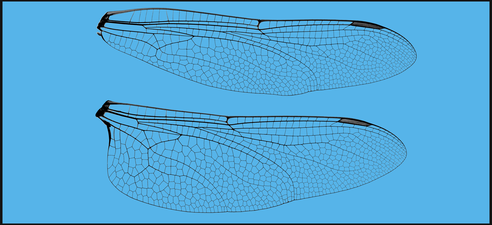
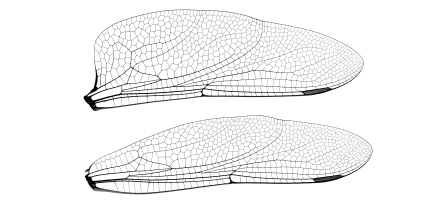

## Overview

Welcome to the hands-on, practical learning portion of [Lesson 2](https://stri-con.github.io/data-curation/2020/04/09/lesson-2/) where you will create a single page R Markdown document. I made this page to help guide you in the process. The material below contains a series of assignments and challenges designed to get you comfortable utilizing [YAML metadata](https://stri-con.github.io/data-curation/2020/04/09/lesson-2/#the-yaml-header-1), [Markdown syntax](https://stri-con.github.io/data-curation/2020/04/09/lesson-2/#markdown-formatted-text-1), and [R code chunks](https://stri-con.github.io/data-curation/2020/04/09/lesson-2/#r-code-chunks-1).

The page itself is written almost entirely in R Markdown, meaning there is no extensive use of anything fancy like complicated  CSS or HTML. I will introduce some simple HTML code you can use to jazz up your document a little. You should be able to solve any problem I present by digging around in the raw code on GitHub, consulting the [Resources page](https://stri-con.github.io/data-curation/page/resources/), using one of the targeted search strategies described in the [Problem Solving post](https://stri-con.github.io/data-curation/2020/04/03/help/), and/or posting a question to the Slack channel.

## Some Keys to Success

> **Knit often**. Whenever you make a change to the YAML header, add a new code chunk, etc., re-knit (or render) your document. This is very important. Regular knitting allows you to **a**) see the effects of a change and **b**) track down (troubleshoot) issues more easily.
>
> Simply hit the knit button or use the shortcut keys---on MacOS `Cmd`+`Shift`+`K` and Windows `Ctrl`+`Shift`+`K`. Learn to love these shortcut keys. They will save you time.

You can choose how your document is previewed using the drop down menu in the document settings. `Preview in Window` opens the document in a separate RStudio window and `Preview in Viewer Pane` lets you see the document in the main RStudio IDE. These are good for *quick* looks. You should **always** double-check the actual HTML file because sometimes things look different in RStudio.
<br/>


Something to consider while you create your page is *readability*. This not only applies to the final document but also the raw R Markdown code itself. Think about someone digging through your code to figure out how you did something. Or think about yourself coming back to the code after a few years. The better your document is formatted, the easier it will be to understand. In future lessons we will return to some best practices but for now remember, part of what we are doing here is making your science more *transparent* and *reproducible*. If your document is confusing to follow then it serves neither of these purposes.

## Assignment 1: The Basics

In the first assignment, you will employ some basic techniques to control the look of your document and how R code chunks are rendered. We will cover YAML metadata modifications, setting global chunk options, and writing Markdown content. You will also learn about testing R code first before rendering the final document.

### 1.1 Make a Document

If you have not already done so, your first task is to create an R Markdown document. Open R Studio and go to `File > New File > R Markdown`. A window should pop up where you can fill in the details. It is not important what you put here since you can change it at any time. What is important is that **Document** and **HTML** are both selected. We will cover other document types in the future. Hit `Ok` and follow the steps in this graphic. Remember, you do not need to add a file extension when you save the document.

<br/>


<br/>

Once you have a document built and saved, there should be a `.html` file in your working directory. Double-click that file---it should open in your default browser. Each time you re-knit the `.Rmd` file, you can just refresh the browser page or double-click the file again.

### 1.2 Add Markdown Text

Your first task is to add some content and format the content with Markdown. This doesn't need to be anything fancy to start. You can either add text as you go or paste a large amount of text in at once. Dealers choice. You can use the [Markdown](https://stri-con.github.io/data-curation/2020/03/28/lesson-0/#markdown-3) section of Lesson 0 or the [Markdown](https://stri-con.github.io/data-curation/page/resources/#markdown) section from the Resources page for reference.

1) Add headers to give the document structure. Use different header levels.
2) Add hyperlinks. We will learn about *internal* links later. For now, just link to outside websites.
3) Add emphasis formatting like bold, italics, and block text.
4) Mix and match formatting, like make a hyperlink bold or add italics to block text.
5) Make a list of items.

### 1.3 Modify & Test R Code Chunks

Now it is time to get some practice modifying code chunk options so you can gain more control over the behavior of code and result display. If you have your own R code you are more than welcome to use it here. I will use the default code chunks that were added to the `.Rmd` file. Please see the section on [Chunk structure & options](https://stri-con.github.io/data-curation/2020/04/09/lesson-2/#chunk-structure-options-1) from Lesson 2 for more details.

Here are the two default code chunks. As you can see, both have names and the second chunk has a single option.

````
```{r cars}
summary(cars)
```
````

````
```{r pressure, echo=FALSE}
plot(pressure)
```
````

There are many code chunk options you can control. Which options you use and how you set them will be determined by your needs. Test the behavior of the following options by setting each equal to either `TRUE` or `FALSE`. Render the document and see if you can figure out what changed. Each of these has a default value so you may not see a change until you set the alternative value.

1) `echo`
2) `collapse`
3) `eval`
4) `prompt`
5) `highlight`
6) `include`

Next, it is a really good habit to check code chunks as you add them. This will ensure that each chunk works, making it easier to track down problems. If you refer to the first image on this page, you can you have options for **Chunk Output**---*Inline* and *Console*. This controls where the output is displayed. Let's take a quick look at a code chunk in RStudio and see how you test chunks before rendering.


Take a look at the tool bar on the far right. **Option 1** is a drop down menu that gives you an alternative way to set code chunk options. **Option 2** will *Run all Code Chunks Above* meaning that RStudio will run all code chunks above the current chunk but not the current chunk itself. And **Option 3** will *Run the Current Chunk*. Incidentally, if you do not see these options it means something is wrong with the chunk.

Go ahead and run the chunk.

### 1.4 Modify YAML Metadata

You last task is to modify the YAML header to suit your needs and tastes. I would like you to experiment with different options and settings to see what happens in the final document.

1) Run `?rmarkdown::html_document` or `?html_document` in the Console to see the header options for an HTML document.
2) Add a table of contents and include options that modify the behavior of the table of contents.
3) Add the option to keep the Markdown document. This will save a `.md` copy of your file.
4) Open the `.md` file in a text editor. This is the output from `knitr`---after all R code has been processed---and what PanDoc uses to generate an HTML file. Keep this file open as you build your document. Pay attention to how your R code is converted to Markdown syntax.
5) Change the theme. Options are listed on the *Convert to an HTML document* help page you opened in RStudio. Try a few options and see what happens.
6) Change the code highlight option. These too are listed on the help page. Try a few options and see what happens.

## Assignment 2: Tables

In this assignment, you will explore different methods of incorporating tables in your document. The choice of method depends on **a**) the type of data, **b**) the amount of data, and **c**) the desired output. I will cover a few tools for creating tables but please note there are [many options](https://rfortherestofus.com/2019/11/how-to-make-beautiful-tables-in-r/) out there, so look around and let us know if you find a tool you like.

For each example, I will use the `mtcars` data set from the `datasets` package. The `mtcars` data set has 32 rows and 11 columns. Feel free to load your own data table or use the `mtcars` data set.

### Tools

You will use four different tools in this assignment for making tables. Here is a summary table of of each tool.

| Table type                    | Table size       |  Formatting Options  | Skill Level      |
|-------------------------------|:----------------:|:--------------------:|:----------------:|
| `markdown`                    | small            | minimal              | beginner         |
| `rmarkdown::paged_table`      | large            | minimal              | beginner         |
| `knitr::kable` + `kableExtra` | small            | extensive            | intermediate     |
| `DT` + `DataTables`           | large            | extensive            | advanced         |
Table: *Table types and recommended uses.*

<br/>

### 2.1 Markdown

The simplest method of building a table is with Markdown syntax. This is a nice option because you can hard code the table right into the document---no need to install and load libraries or write code chunks---and it is easy to implement. The downside is there is minimal functionality available in a Markdown table.

Markdown does not work well for large tables. So I will first grab a subset of `mtcars`, specifically the first 4 rows and 3 columns. In my code chunk I add the chunk option `comment=""`. This prevents knit from appending a string (default is `##`) to the start of each line of results in the final document.


```r
mtcars_sub <- mtcars[1:4,1:3]
mtcars_sub
```

```
                mpg cyl disp
Mazda RX4      21.0   6  160
Mazda RX4 Wag  21.0   6  160
Datsun 710     22.8   4  108
Hornet 4 Drive 21.4   6  258
```

<br/>

*Incidentally, the results box above is technically the simplest table you can make, either by calling the data frame `mtcars_sub` directly or running `print.data.frame(mtcars_sub)`.*

Anyway, run this code chunk, copy the results, and make a Markdown table. You can either run the chunk in RStudio without rendering the document (described above) or render the document and copy the results from HTML page. I added a header to the first column. And here is the Markdown table.

<br/>

| model                                                             |  mpg   |  cyl |  disp     |
|:------------------------------------------------------------------|:------:|:----:|----------:|
| [Mazda RX4](https://sco.wikipedia.org/wiki/Mazda_RX-4)            | *21.0* | **6**|    160    |
| `Mazda RX4 Wag`                                                   | *21.0* |   6  |    160    |
| [Datsun 710](https://en.wikipedia.org/wiki/Nissan_Violet#710)     | *22.8* |   4  |    108    |
| [Hornet 4 Drive](https://en.wikipedia.org/wiki/AMC_Hornet)        | 21.4   |   6  |  **258**  |
Table:  *Demonstration of the output from `pipe_tables` Markdown syntax.*

<br/>

Since this is a Markdown table, you can add additional Markdown syntax for formatting. See if you can figure out what syntax I added to my table and add some to your table. Also check out the *Tables* section of [PanDoc User's Guide](https://pandoc.org/MANUAL.html#tables) for other Markdown table options, including how to add a caption. In addition to `pipe_tables`, you can create `multiline_tables` `grid_tables`, and `simple_tables`.

Something to notice is that the Markdown table spans the entire width of the page---even though it does not need all of that space. As far as I know, there is no way to control this behavior without adding additional HTML formatting.

> **Recommendation** Use `Markdown` for small, simple tables where styling is not a concern.

### 2.2 R Markdown Paged Tables

With larger tables, it may not be practical to display the full table inline. So we need a way to shrink a large table so it looks good while still allowing access to the full table.

The next type of table I want you to try are Paged Tables. R Markdown comes with its own built in table function called `paged_table`. The `paged_table` function allows pagination of rows and columns making it possible to render a large table in a small space.

It is easy to code `paged_table` but that ease comes with a small price---limited functionality. Here are the options you do have with `paged_table` function.

| Option           | Description                                    |
|------------------|------------------------------------------------|
| `rows.print`     | Maximum rows to print per page.                |
| `max.print`      | Maximum rows in the table (defaults to 1000).  |
| `cols.print`     | Maximum columns in the table (defaults to 10). |
| `rownames.print` | Print row names as part of the table.          |
Table: *A Markdown table listing the Options for the `paged_table` function. *

***A quick side note***. You actually need to load the `rmarkdown` package for `paged_table` to work. Anyway, this is a good time to return to the first code chunk in your `.Rmd` file---the chunk called `setup` that R Markdown added by default.

I like to use this chunk to load all of the packages I need for my document. Using a single chunk for all of my packages helps me keep my document organized. Notice the `setup` chunk has the option `include=FALSE`. This prevents the content of the chunk from appearing in the final document, which for me is more stylistically appealing.  I can add a `sessionInfo()` chunk at the end of my document to report all of the packages so this information is available to the reader. We will cover `sessionInfo()` when we get into more depth on the subject of *reproducible*. If you do not want to load the library you can run the command like this: `rmarkdown::paged_table()`.

***OK, back to the table***. Now I can create a table of `mtcars` with the `paged_table` function and use an option to limit the number of printed rows to `5` for each page. I used `echo=FALSE` in my code chunk to hide the code :). By now you should know where to look for a solution.

<br/>

<div data-pagedtable="false">
  <script data-pagedtable-source type="application/json">
{"columns":[{"label":[""],"name":["_rn_"],"type":[""],"align":["left"]},{"label":["mpg"],"name":[1],"type":["dbl"],"align":["right"]},{"label":["cyl"],"name":[2],"type":["dbl"],"align":["right"]},{"label":["disp"],"name":[3],"type":["dbl"],"align":["right"]},{"label":["hp"],"name":[4],"type":["dbl"],"align":["right"]},{"label":["drat"],"name":[5],"type":["dbl"],"align":["right"]},{"label":["wt"],"name":[6],"type":["dbl"],"align":["right"]},{"label":["qsec"],"name":[7],"type":["dbl"],"align":["right"]},{"label":["vs"],"name":[8],"type":["dbl"],"align":["right"]},{"label":["am"],"name":[9],"type":["dbl"],"align":["right"]},{"label":["gear"],"name":[10],"type":["dbl"],"align":["right"]},{"label":["carb"],"name":[11],"type":["dbl"],"align":["right"]}],"data":[{"1":"21.0","2":"6","3":"160.0","4":"110","5":"3.90","6":"2.620","7":"16.46","8":"0","9":"1","10":"4","11":"4","_rn_":"Mazda RX4"},{"1":"21.0","2":"6","3":"160.0","4":"110","5":"3.90","6":"2.875","7":"17.02","8":"0","9":"1","10":"4","11":"4","_rn_":"Mazda RX4 Wag"},{"1":"22.8","2":"4","3":"108.0","4":"93","5":"3.85","6":"2.320","7":"18.61","8":"1","9":"1","10":"4","11":"1","_rn_":"Datsun 710"},{"1":"21.4","2":"6","3":"258.0","4":"110","5":"3.08","6":"3.215","7":"19.44","8":"1","9":"0","10":"3","11":"1","_rn_":"Hornet 4 Drive"},{"1":"18.7","2":"8","3":"360.0","4":"175","5":"3.15","6":"3.440","7":"17.02","8":"0","9":"0","10":"3","11":"2","_rn_":"Hornet Sportabout"},{"1":"18.1","2":"6","3":"225.0","4":"105","5":"2.76","6":"3.460","7":"20.22","8":"1","9":"0","10":"3","11":"1","_rn_":"Valiant"},{"1":"14.3","2":"8","3":"360.0","4":"245","5":"3.21","6":"3.570","7":"15.84","8":"0","9":"0","10":"3","11":"4","_rn_":"Duster 360"},{"1":"24.4","2":"4","3":"146.7","4":"62","5":"3.69","6":"3.190","7":"20.00","8":"1","9":"0","10":"4","11":"2","_rn_":"Merc 240D"},{"1":"22.8","2":"4","3":"140.8","4":"95","5":"3.92","6":"3.150","7":"22.90","8":"1","9":"0","10":"4","11":"2","_rn_":"Merc 230"},{"1":"19.2","2":"6","3":"167.6","4":"123","5":"3.92","6":"3.440","7":"18.30","8":"1","9":"0","10":"4","11":"4","_rn_":"Merc 280"},{"1":"17.8","2":"6","3":"167.6","4":"123","5":"3.92","6":"3.440","7":"18.90","8":"1","9":"0","10":"4","11":"4","_rn_":"Merc 280C"},{"1":"16.4","2":"8","3":"275.8","4":"180","5":"3.07","6":"4.070","7":"17.40","8":"0","9":"0","10":"3","11":"3","_rn_":"Merc 450SE"},{"1":"17.3","2":"8","3":"275.8","4":"180","5":"3.07","6":"3.730","7":"17.60","8":"0","9":"0","10":"3","11":"3","_rn_":"Merc 450SL"},{"1":"15.2","2":"8","3":"275.8","4":"180","5":"3.07","6":"3.780","7":"18.00","8":"0","9":"0","10":"3","11":"3","_rn_":"Merc 450SLC"},{"1":"10.4","2":"8","3":"472.0","4":"205","5":"2.93","6":"5.250","7":"17.98","8":"0","9":"0","10":"3","11":"4","_rn_":"Cadillac Fleetwood"},{"1":"10.4","2":"8","3":"460.0","4":"215","5":"3.00","6":"5.424","7":"17.82","8":"0","9":"0","10":"3","11":"4","_rn_":"Lincoln Continental"},{"1":"14.7","2":"8","3":"440.0","4":"230","5":"3.23","6":"5.345","7":"17.42","8":"0","9":"0","10":"3","11":"4","_rn_":"Chrysler Imperial"},{"1":"32.4","2":"4","3":"78.7","4":"66","5":"4.08","6":"2.200","7":"19.47","8":"1","9":"1","10":"4","11":"1","_rn_":"Fiat 128"},{"1":"30.4","2":"4","3":"75.7","4":"52","5":"4.93","6":"1.615","7":"18.52","8":"1","9":"1","10":"4","11":"2","_rn_":"Honda Civic"},{"1":"33.9","2":"4","3":"71.1","4":"65","5":"4.22","6":"1.835","7":"19.90","8":"1","9":"1","10":"4","11":"1","_rn_":"Toyota Corolla"},{"1":"21.5","2":"4","3":"120.1","4":"97","5":"3.70","6":"2.465","7":"20.01","8":"1","9":"0","10":"3","11":"1","_rn_":"Toyota Corona"},{"1":"15.5","2":"8","3":"318.0","4":"150","5":"2.76","6":"3.520","7":"16.87","8":"0","9":"0","10":"3","11":"2","_rn_":"Dodge Challenger"},{"1":"15.2","2":"8","3":"304.0","4":"150","5":"3.15","6":"3.435","7":"17.30","8":"0","9":"0","10":"3","11":"2","_rn_":"AMC Javelin"},{"1":"13.3","2":"8","3":"350.0","4":"245","5":"3.73","6":"3.840","7":"15.41","8":"0","9":"0","10":"3","11":"4","_rn_":"Camaro Z28"},{"1":"19.2","2":"8","3":"400.0","4":"175","5":"3.08","6":"3.845","7":"17.05","8":"0","9":"0","10":"3","11":"2","_rn_":"Pontiac Firebird"},{"1":"27.3","2":"4","3":"79.0","4":"66","5":"4.08","6":"1.935","7":"18.90","8":"1","9":"1","10":"4","11":"1","_rn_":"Fiat X1-9"},{"1":"26.0","2":"4","3":"120.3","4":"91","5":"4.43","6":"2.140","7":"16.70","8":"0","9":"1","10":"5","11":"2","_rn_":"Porsche 914-2"},{"1":"30.4","2":"4","3":"95.1","4":"113","5":"3.77","6":"1.513","7":"16.90","8":"1","9":"1","10":"5","11":"2","_rn_":"Lotus Europa"},{"1":"15.8","2":"8","3":"351.0","4":"264","5":"4.22","6":"3.170","7":"14.50","8":"0","9":"1","10":"5","11":"4","_rn_":"Ford Pantera L"},{"1":"19.7","2":"6","3":"145.0","4":"175","5":"3.62","6":"2.770","7":"15.50","8":"0","9":"1","10":"5","11":"6","_rn_":"Ferrari Dino"},{"1":"15.0","2":"8","3":"301.0","4":"335","5":"3.54","6":"3.570","7":"14.60","8":"0","9":"1","10":"5","11":"8","_rn_":"Maserati Bora"},{"1":"21.4","2":"4","3":"121.0","4":"109","5":"4.11","6":"2.780","7":"18.60","8":"1","9":"1","10":"4","11":"2","_rn_":"Volvo 142E"}],"options":{"columns":{"min":{},"max":[10]},"rows":{"min":[5],"max":[5]},"pages":{}}}
  </script>
</div>

Notice that for each column, the column *class* is printed below the name (text enclosed in < >). This is irritating and related to printing a table from a built-in data frame. I have no idea how to fix this (within the confines of R Markdown) but I will work on a solution.

> **Recommendation** Use `paged_table` for large tables where extensive styling is not a concern.

### 2.3 Kable Tables

Knitr comes with its own tool for rendering simple tables called `kable`. The documentation for `kable` can be found [here](https://cran.r-project.org/web/packages/kableExtra/index.html) or by running `?knitr::kable()` in the Console. By itself, kable  comes with *almost no options*. We can extend its functionality with the `kableExtra` package and piping syntax from `magrittr`. The features of `kableExtra`  are extensive and I will only touch on a few here. The documentation for `kableExtra` can be found [here](https://cran.r-project.org/web/packages/kableExtra/index.html) or by running `?kableExtra` in the Console after the package has been installed and loaded.

> I highly recommend you [learn how to use these packages](https://cran.r-project.org/web/packages/kableExtra/vignettes/awesome_table_in_html.html) for making tables.

Again, you will need to load `kableExtra` and either load the `knitr` package or run the command like this: `knitr::kable()`.

First, let’s look at the default `kable` table output. We will use the head of the `mtcars` data set.

<br/>


```r
kable(head(mtcars), caption = "*Wow, this table looks terrible.*")
```

<table>
<caption>*Wow, this table looks terrible.*</caption>
 <thead>
  <tr>
   <th style="text-align:left;">   </th>
   <th style="text-align:right;"> mpg </th>
   <th style="text-align:right;"> cyl </th>
   <th style="text-align:right;"> disp </th>
   <th style="text-align:right;"> hp </th>
   <th style="text-align:right;"> drat </th>
   <th style="text-align:right;"> wt </th>
   <th style="text-align:right;"> qsec </th>
   <th style="text-align:right;"> vs </th>
   <th style="text-align:right;"> am </th>
   <th style="text-align:right;"> gear </th>
   <th style="text-align:right;"> carb </th>
  </tr>
 </thead>
<tbody>
  <tr>
   <td style="text-align:left;"> Mazda RX4 </td>
   <td style="text-align:right;"> 21.0 </td>
   <td style="text-align:right;"> 6 </td>
   <td style="text-align:right;"> 160 </td>
   <td style="text-align:right;"> 110 </td>
   <td style="text-align:right;"> 3.90 </td>
   <td style="text-align:right;"> 2.620 </td>
   <td style="text-align:right;"> 16.46 </td>
   <td style="text-align:right;"> 0 </td>
   <td style="text-align:right;"> 1 </td>
   <td style="text-align:right;"> 4 </td>
   <td style="text-align:right;"> 4 </td>
  </tr>
  <tr>
   <td style="text-align:left;"> Mazda RX4 Wag </td>
   <td style="text-align:right;"> 21.0 </td>
   <td style="text-align:right;"> 6 </td>
   <td style="text-align:right;"> 160 </td>
   <td style="text-align:right;"> 110 </td>
   <td style="text-align:right;"> 3.90 </td>
   <td style="text-align:right;"> 2.875 </td>
   <td style="text-align:right;"> 17.02 </td>
   <td style="text-align:right;"> 0 </td>
   <td style="text-align:right;"> 1 </td>
   <td style="text-align:right;"> 4 </td>
   <td style="text-align:right;"> 4 </td>
  </tr>
  <tr>
   <td style="text-align:left;"> Datsun 710 </td>
   <td style="text-align:right;"> 22.8 </td>
   <td style="text-align:right;"> 4 </td>
   <td style="text-align:right;"> 108 </td>
   <td style="text-align:right;"> 93 </td>
   <td style="text-align:right;"> 3.85 </td>
   <td style="text-align:right;"> 2.320 </td>
   <td style="text-align:right;"> 18.61 </td>
   <td style="text-align:right;"> 1 </td>
   <td style="text-align:right;"> 1 </td>
   <td style="text-align:right;"> 4 </td>
   <td style="text-align:right;"> 1 </td>
  </tr>
  <tr>
   <td style="text-align:left;"> Hornet 4 Drive </td>
   <td style="text-align:right;"> 21.4 </td>
   <td style="text-align:right;"> 6 </td>
   <td style="text-align:right;"> 258 </td>
   <td style="text-align:right;"> 110 </td>
   <td style="text-align:right;"> 3.08 </td>
   <td style="text-align:right;"> 3.215 </td>
   <td style="text-align:right;"> 19.44 </td>
   <td style="text-align:right;"> 1 </td>
   <td style="text-align:right;"> 0 </td>
   <td style="text-align:right;"> 3 </td>
   <td style="text-align:right;"> 1 </td>
  </tr>
  <tr>
   <td style="text-align:left;"> Hornet Sportabout </td>
   <td style="text-align:right;"> 18.7 </td>
   <td style="text-align:right;"> 8 </td>
   <td style="text-align:right;"> 360 </td>
   <td style="text-align:right;"> 175 </td>
   <td style="text-align:right;"> 3.15 </td>
   <td style="text-align:right;"> 3.440 </td>
   <td style="text-align:right;"> 17.02 </td>
   <td style="text-align:right;"> 0 </td>
   <td style="text-align:right;"> 0 </td>
   <td style="text-align:right;"> 3 </td>
   <td style="text-align:right;"> 2 </td>
  </tr>
  <tr>
   <td style="text-align:left;"> Valiant </td>
   <td style="text-align:right;"> 18.1 </td>
   <td style="text-align:right;"> 6 </td>
   <td style="text-align:right;"> 225 </td>
   <td style="text-align:right;"> 105 </td>
   <td style="text-align:right;"> 2.76 </td>
   <td style="text-align:right;"> 3.460 </td>
   <td style="text-align:right;"> 20.22 </td>
   <td style="text-align:right;"> 1 </td>
   <td style="text-align:right;"> 0 </td>
   <td style="text-align:right;"> 3 </td>
   <td style="text-align:right;"> 1 </td>
  </tr>
</tbody>
</table>

<br/>

If we tried to render the entire table by omitting `head`, we would just get a long, crappy table in our document. Not cool. Lets see if we can jazz this up a bit with `kableExtra`.


```r
kable(head(mtcars), caption = "*This table looks better*") %>%
  kable_styling()
```

<table class="table" style="margin-left: auto; margin-right: auto;">
<caption>*This table looks better*</caption>
 <thead>
  <tr>
   <th style="text-align:left;">   </th>
   <th style="text-align:right;"> mpg </th>
   <th style="text-align:right;"> cyl </th>
   <th style="text-align:right;"> disp </th>
   <th style="text-align:right;"> hp </th>
   <th style="text-align:right;"> drat </th>
   <th style="text-align:right;"> wt </th>
   <th style="text-align:right;"> qsec </th>
   <th style="text-align:right;"> vs </th>
   <th style="text-align:right;"> am </th>
   <th style="text-align:right;"> gear </th>
   <th style="text-align:right;"> carb </th>
  </tr>
 </thead>
<tbody>
  <tr>
   <td style="text-align:left;"> Mazda RX4 </td>
   <td style="text-align:right;"> 21.0 </td>
   <td style="text-align:right;"> 6 </td>
   <td style="text-align:right;"> 160 </td>
   <td style="text-align:right;"> 110 </td>
   <td style="text-align:right;"> 3.90 </td>
   <td style="text-align:right;"> 2.620 </td>
   <td style="text-align:right;"> 16.46 </td>
   <td style="text-align:right;"> 0 </td>
   <td style="text-align:right;"> 1 </td>
   <td style="text-align:right;"> 4 </td>
   <td style="text-align:right;"> 4 </td>
  </tr>
  <tr>
   <td style="text-align:left;"> Mazda RX4 Wag </td>
   <td style="text-align:right;"> 21.0 </td>
   <td style="text-align:right;"> 6 </td>
   <td style="text-align:right;"> 160 </td>
   <td style="text-align:right;"> 110 </td>
   <td style="text-align:right;"> 3.90 </td>
   <td style="text-align:right;"> 2.875 </td>
   <td style="text-align:right;"> 17.02 </td>
   <td style="text-align:right;"> 0 </td>
   <td style="text-align:right;"> 1 </td>
   <td style="text-align:right;"> 4 </td>
   <td style="text-align:right;"> 4 </td>
  </tr>
  <tr>
   <td style="text-align:left;"> Datsun 710 </td>
   <td style="text-align:right;"> 22.8 </td>
   <td style="text-align:right;"> 4 </td>
   <td style="text-align:right;"> 108 </td>
   <td style="text-align:right;"> 93 </td>
   <td style="text-align:right;"> 3.85 </td>
   <td style="text-align:right;"> 2.320 </td>
   <td style="text-align:right;"> 18.61 </td>
   <td style="text-align:right;"> 1 </td>
   <td style="text-align:right;"> 1 </td>
   <td style="text-align:right;"> 4 </td>
   <td style="text-align:right;"> 1 </td>
  </tr>
  <tr>
   <td style="text-align:left;"> Hornet 4 Drive </td>
   <td style="text-align:right;"> 21.4 </td>
   <td style="text-align:right;"> 6 </td>
   <td style="text-align:right;"> 258 </td>
   <td style="text-align:right;"> 110 </td>
   <td style="text-align:right;"> 3.08 </td>
   <td style="text-align:right;"> 3.215 </td>
   <td style="text-align:right;"> 19.44 </td>
   <td style="text-align:right;"> 1 </td>
   <td style="text-align:right;"> 0 </td>
   <td style="text-align:right;"> 3 </td>
   <td style="text-align:right;"> 1 </td>
  </tr>
  <tr>
   <td style="text-align:left;"> Hornet Sportabout </td>
   <td style="text-align:right;"> 18.7 </td>
   <td style="text-align:right;"> 8 </td>
   <td style="text-align:right;"> 360 </td>
   <td style="text-align:right;"> 175 </td>
   <td style="text-align:right;"> 3.15 </td>
   <td style="text-align:right;"> 3.440 </td>
   <td style="text-align:right;"> 17.02 </td>
   <td style="text-align:right;"> 0 </td>
   <td style="text-align:right;"> 0 </td>
   <td style="text-align:right;"> 3 </td>
   <td style="text-align:right;"> 2 </td>
  </tr>
  <tr>
   <td style="text-align:left;"> Valiant </td>
   <td style="text-align:right;"> 18.1 </td>
   <td style="text-align:right;"> 6 </td>
   <td style="text-align:right;"> 225 </td>
   <td style="text-align:right;"> 105 </td>
   <td style="text-align:right;"> 2.76 </td>
   <td style="text-align:right;"> 3.460 </td>
   <td style="text-align:right;"> 20.22 </td>
   <td style="text-align:right;"> 1 </td>
   <td style="text-align:right;"> 0 </td>
   <td style="text-align:right;"> 3 </td>
   <td style="text-align:right;"> 1 </td>
  </tr>
</tbody>
</table>

Here I used the [pipe operator](https://riptutorial.com/r/topic/652/pipe-operators------and-others-) (`%>%`) to pass the results of `kable` to the function `kable_styling`---a part of the `kableExtra` package. By running  `kable_styling` *as is*, I am using defaults for all of the options.

> The pipe operator is a powerful tool worth learning.

Back to the table. It certainly looks better than the default `kable` version but we are missing the ability to *page* the table. I would like you to run these two commands and look at the output.

This command will include the whole table.

```
kable(mtcars) %>%
  kable_styling()
```

And this command will transpose the table (swap rows and columns) using the transpose (`t`) function. Remember, `mtcars` has 32 rows and 11 columns but when you transpose the table, it has 11 rows and 32 columns. So it is really wide in the transposed state.

```
kable(head(t(mtcars))) %>%
  kable_styling()
```

I hope you agree that neither of these tables are acceptable, especially the second one. Unfortunately, the `kableExtra` package does not come with an option to add pagination. You can however put the table in a fixed-height, fixed-width (or both) box, and make it scrollable. We can do this by using a pipe operator and the `scroll_box` function. While we are at it, lets also add tweak some options in `kable_styling` to make a more handsome table.


```r
kable(t(mtcars), caption = "*Scrollable kable table.*") %>%
  kable_styling(bootstrap_options = c("striped", "hover",
                                      "condensed", "responsive")) %>%
  scroll_box(width = "100%", height = "300px")
```

<div style="border: 1px solid #ddd; padding: 0px; overflow-y: scroll; height:300px; overflow-x: scroll; width:100%; "><table class="table table-striped table-hover table-condensed table-responsive" style="margin-left: auto; margin-right: auto;">
<caption>*Scrollable kable table.*</caption>
 <thead>
  <tr>
   <th style="text-align:left;position: sticky; top:0; background-color: #FFFFFF;">   </th>
   <th style="text-align:right;position: sticky; top:0; background-color: #FFFFFF;"> Mazda RX4 </th>
   <th style="text-align:right;position: sticky; top:0; background-color: #FFFFFF;"> Mazda RX4 Wag </th>
   <th style="text-align:right;position: sticky; top:0; background-color: #FFFFFF;"> Datsun 710 </th>
   <th style="text-align:right;position: sticky; top:0; background-color: #FFFFFF;"> Hornet 4 Drive </th>
   <th style="text-align:right;position: sticky; top:0; background-color: #FFFFFF;"> Hornet Sportabout </th>
   <th style="text-align:right;position: sticky; top:0; background-color: #FFFFFF;"> Valiant </th>
   <th style="text-align:right;position: sticky; top:0; background-color: #FFFFFF;"> Duster 360 </th>
   <th style="text-align:right;position: sticky; top:0; background-color: #FFFFFF;"> Merc 240D </th>
   <th style="text-align:right;position: sticky; top:0; background-color: #FFFFFF;"> Merc 230 </th>
   <th style="text-align:right;position: sticky; top:0; background-color: #FFFFFF;"> Merc 280 </th>
   <th style="text-align:right;position: sticky; top:0; background-color: #FFFFFF;"> Merc 280C </th>
   <th style="text-align:right;position: sticky; top:0; background-color: #FFFFFF;"> Merc 450SE </th>
   <th style="text-align:right;position: sticky; top:0; background-color: #FFFFFF;"> Merc 450SL </th>
   <th style="text-align:right;position: sticky; top:0; background-color: #FFFFFF;"> Merc 450SLC </th>
   <th style="text-align:right;position: sticky; top:0; background-color: #FFFFFF;"> Cadillac Fleetwood </th>
   <th style="text-align:right;position: sticky; top:0; background-color: #FFFFFF;"> Lincoln Continental </th>
   <th style="text-align:right;position: sticky; top:0; background-color: #FFFFFF;"> Chrysler Imperial </th>
   <th style="text-align:right;position: sticky; top:0; background-color: #FFFFFF;"> Fiat 128 </th>
   <th style="text-align:right;position: sticky; top:0; background-color: #FFFFFF;"> Honda Civic </th>
   <th style="text-align:right;position: sticky; top:0; background-color: #FFFFFF;"> Toyota Corolla </th>
   <th style="text-align:right;position: sticky; top:0; background-color: #FFFFFF;"> Toyota Corona </th>
   <th style="text-align:right;position: sticky; top:0; background-color: #FFFFFF;"> Dodge Challenger </th>
   <th style="text-align:right;position: sticky; top:0; background-color: #FFFFFF;"> AMC Javelin </th>
   <th style="text-align:right;position: sticky; top:0; background-color: #FFFFFF;"> Camaro Z28 </th>
   <th style="text-align:right;position: sticky; top:0; background-color: #FFFFFF;"> Pontiac Firebird </th>
   <th style="text-align:right;position: sticky; top:0; background-color: #FFFFFF;"> Fiat X1-9 </th>
   <th style="text-align:right;position: sticky; top:0; background-color: #FFFFFF;"> Porsche 914-2 </th>
   <th style="text-align:right;position: sticky; top:0; background-color: #FFFFFF;"> Lotus Europa </th>
   <th style="text-align:right;position: sticky; top:0; background-color: #FFFFFF;"> Ford Pantera L </th>
   <th style="text-align:right;position: sticky; top:0; background-color: #FFFFFF;"> Ferrari Dino </th>
   <th style="text-align:right;position: sticky; top:0; background-color: #FFFFFF;"> Maserati Bora </th>
   <th style="text-align:right;position: sticky; top:0; background-color: #FFFFFF;"> Volvo 142E </th>
  </tr>
 </thead>
<tbody>
  <tr>
   <td style="text-align:left;"> mpg </td>
   <td style="text-align:right;"> 21.00 </td>
   <td style="text-align:right;"> 21.000 </td>
   <td style="text-align:right;"> 22.80 </td>
   <td style="text-align:right;"> 21.400 </td>
   <td style="text-align:right;"> 18.70 </td>
   <td style="text-align:right;"> 18.10 </td>
   <td style="text-align:right;"> 14.30 </td>
   <td style="text-align:right;"> 24.40 </td>
   <td style="text-align:right;"> 22.80 </td>
   <td style="text-align:right;"> 19.20 </td>
   <td style="text-align:right;"> 17.80 </td>
   <td style="text-align:right;"> 16.40 </td>
   <td style="text-align:right;"> 17.30 </td>
   <td style="text-align:right;"> 15.20 </td>
   <td style="text-align:right;"> 10.40 </td>
   <td style="text-align:right;"> 10.400 </td>
   <td style="text-align:right;"> 14.700 </td>
   <td style="text-align:right;"> 32.40 </td>
   <td style="text-align:right;"> 30.400 </td>
   <td style="text-align:right;"> 33.900 </td>
   <td style="text-align:right;"> 21.500 </td>
   <td style="text-align:right;"> 15.50 </td>
   <td style="text-align:right;"> 15.200 </td>
   <td style="text-align:right;"> 13.30 </td>
   <td style="text-align:right;"> 19.200 </td>
   <td style="text-align:right;"> 27.300 </td>
   <td style="text-align:right;"> 26.00 </td>
   <td style="text-align:right;"> 30.400 </td>
   <td style="text-align:right;"> 15.80 </td>
   <td style="text-align:right;"> 19.70 </td>
   <td style="text-align:right;"> 15.00 </td>
   <td style="text-align:right;"> 21.40 </td>
  </tr>
  <tr>
   <td style="text-align:left;"> cyl </td>
   <td style="text-align:right;"> 6.00 </td>
   <td style="text-align:right;"> 6.000 </td>
   <td style="text-align:right;"> 4.00 </td>
   <td style="text-align:right;"> 6.000 </td>
   <td style="text-align:right;"> 8.00 </td>
   <td style="text-align:right;"> 6.00 </td>
   <td style="text-align:right;"> 8.00 </td>
   <td style="text-align:right;"> 4.00 </td>
   <td style="text-align:right;"> 4.00 </td>
   <td style="text-align:right;"> 6.00 </td>
   <td style="text-align:right;"> 6.00 </td>
   <td style="text-align:right;"> 8.00 </td>
   <td style="text-align:right;"> 8.00 </td>
   <td style="text-align:right;"> 8.00 </td>
   <td style="text-align:right;"> 8.00 </td>
   <td style="text-align:right;"> 8.000 </td>
   <td style="text-align:right;"> 8.000 </td>
   <td style="text-align:right;"> 4.00 </td>
   <td style="text-align:right;"> 4.000 </td>
   <td style="text-align:right;"> 4.000 </td>
   <td style="text-align:right;"> 4.000 </td>
   <td style="text-align:right;"> 8.00 </td>
   <td style="text-align:right;"> 8.000 </td>
   <td style="text-align:right;"> 8.00 </td>
   <td style="text-align:right;"> 8.000 </td>
   <td style="text-align:right;"> 4.000 </td>
   <td style="text-align:right;"> 4.00 </td>
   <td style="text-align:right;"> 4.000 </td>
   <td style="text-align:right;"> 8.00 </td>
   <td style="text-align:right;"> 6.00 </td>
   <td style="text-align:right;"> 8.00 </td>
   <td style="text-align:right;"> 4.00 </td>
  </tr>
  <tr>
   <td style="text-align:left;"> disp </td>
   <td style="text-align:right;"> 160.00 </td>
   <td style="text-align:right;"> 160.000 </td>
   <td style="text-align:right;"> 108.00 </td>
   <td style="text-align:right;"> 258.000 </td>
   <td style="text-align:right;"> 360.00 </td>
   <td style="text-align:right;"> 225.00 </td>
   <td style="text-align:right;"> 360.00 </td>
   <td style="text-align:right;"> 146.70 </td>
   <td style="text-align:right;"> 140.80 </td>
   <td style="text-align:right;"> 167.60 </td>
   <td style="text-align:right;"> 167.60 </td>
   <td style="text-align:right;"> 275.80 </td>
   <td style="text-align:right;"> 275.80 </td>
   <td style="text-align:right;"> 275.80 </td>
   <td style="text-align:right;"> 472.00 </td>
   <td style="text-align:right;"> 460.000 </td>
   <td style="text-align:right;"> 440.000 </td>
   <td style="text-align:right;"> 78.70 </td>
   <td style="text-align:right;"> 75.700 </td>
   <td style="text-align:right;"> 71.100 </td>
   <td style="text-align:right;"> 120.100 </td>
   <td style="text-align:right;"> 318.00 </td>
   <td style="text-align:right;"> 304.000 </td>
   <td style="text-align:right;"> 350.00 </td>
   <td style="text-align:right;"> 400.000 </td>
   <td style="text-align:right;"> 79.000 </td>
   <td style="text-align:right;"> 120.30 </td>
   <td style="text-align:right;"> 95.100 </td>
   <td style="text-align:right;"> 351.00 </td>
   <td style="text-align:right;"> 145.00 </td>
   <td style="text-align:right;"> 301.00 </td>
   <td style="text-align:right;"> 121.00 </td>
  </tr>
  <tr>
   <td style="text-align:left;"> hp </td>
   <td style="text-align:right;"> 110.00 </td>
   <td style="text-align:right;"> 110.000 </td>
   <td style="text-align:right;"> 93.00 </td>
   <td style="text-align:right;"> 110.000 </td>
   <td style="text-align:right;"> 175.00 </td>
   <td style="text-align:right;"> 105.00 </td>
   <td style="text-align:right;"> 245.00 </td>
   <td style="text-align:right;"> 62.00 </td>
   <td style="text-align:right;"> 95.00 </td>
   <td style="text-align:right;"> 123.00 </td>
   <td style="text-align:right;"> 123.00 </td>
   <td style="text-align:right;"> 180.00 </td>
   <td style="text-align:right;"> 180.00 </td>
   <td style="text-align:right;"> 180.00 </td>
   <td style="text-align:right;"> 205.00 </td>
   <td style="text-align:right;"> 215.000 </td>
   <td style="text-align:right;"> 230.000 </td>
   <td style="text-align:right;"> 66.00 </td>
   <td style="text-align:right;"> 52.000 </td>
   <td style="text-align:right;"> 65.000 </td>
   <td style="text-align:right;"> 97.000 </td>
   <td style="text-align:right;"> 150.00 </td>
   <td style="text-align:right;"> 150.000 </td>
   <td style="text-align:right;"> 245.00 </td>
   <td style="text-align:right;"> 175.000 </td>
   <td style="text-align:right;"> 66.000 </td>
   <td style="text-align:right;"> 91.00 </td>
   <td style="text-align:right;"> 113.000 </td>
   <td style="text-align:right;"> 264.00 </td>
   <td style="text-align:right;"> 175.00 </td>
   <td style="text-align:right;"> 335.00 </td>
   <td style="text-align:right;"> 109.00 </td>
  </tr>
  <tr>
   <td style="text-align:left;"> drat </td>
   <td style="text-align:right;"> 3.90 </td>
   <td style="text-align:right;"> 3.900 </td>
   <td style="text-align:right;"> 3.85 </td>
   <td style="text-align:right;"> 3.080 </td>
   <td style="text-align:right;"> 3.15 </td>
   <td style="text-align:right;"> 2.76 </td>
   <td style="text-align:right;"> 3.21 </td>
   <td style="text-align:right;"> 3.69 </td>
   <td style="text-align:right;"> 3.92 </td>
   <td style="text-align:right;"> 3.92 </td>
   <td style="text-align:right;"> 3.92 </td>
   <td style="text-align:right;"> 3.07 </td>
   <td style="text-align:right;"> 3.07 </td>
   <td style="text-align:right;"> 3.07 </td>
   <td style="text-align:right;"> 2.93 </td>
   <td style="text-align:right;"> 3.000 </td>
   <td style="text-align:right;"> 3.230 </td>
   <td style="text-align:right;"> 4.08 </td>
   <td style="text-align:right;"> 4.930 </td>
   <td style="text-align:right;"> 4.220 </td>
   <td style="text-align:right;"> 3.700 </td>
   <td style="text-align:right;"> 2.76 </td>
   <td style="text-align:right;"> 3.150 </td>
   <td style="text-align:right;"> 3.73 </td>
   <td style="text-align:right;"> 3.080 </td>
   <td style="text-align:right;"> 4.080 </td>
   <td style="text-align:right;"> 4.43 </td>
   <td style="text-align:right;"> 3.770 </td>
   <td style="text-align:right;"> 4.22 </td>
   <td style="text-align:right;"> 3.62 </td>
   <td style="text-align:right;"> 3.54 </td>
   <td style="text-align:right;"> 4.11 </td>
  </tr>
  <tr>
   <td style="text-align:left;"> wt </td>
   <td style="text-align:right;"> 2.62 </td>
   <td style="text-align:right;"> 2.875 </td>
   <td style="text-align:right;"> 2.32 </td>
   <td style="text-align:right;"> 3.215 </td>
   <td style="text-align:right;"> 3.44 </td>
   <td style="text-align:right;"> 3.46 </td>
   <td style="text-align:right;"> 3.57 </td>
   <td style="text-align:right;"> 3.19 </td>
   <td style="text-align:right;"> 3.15 </td>
   <td style="text-align:right;"> 3.44 </td>
   <td style="text-align:right;"> 3.44 </td>
   <td style="text-align:right;"> 4.07 </td>
   <td style="text-align:right;"> 3.73 </td>
   <td style="text-align:right;"> 3.78 </td>
   <td style="text-align:right;"> 5.25 </td>
   <td style="text-align:right;"> 5.424 </td>
   <td style="text-align:right;"> 5.345 </td>
   <td style="text-align:right;"> 2.20 </td>
   <td style="text-align:right;"> 1.615 </td>
   <td style="text-align:right;"> 1.835 </td>
   <td style="text-align:right;"> 2.465 </td>
   <td style="text-align:right;"> 3.52 </td>
   <td style="text-align:right;"> 3.435 </td>
   <td style="text-align:right;"> 3.84 </td>
   <td style="text-align:right;"> 3.845 </td>
   <td style="text-align:right;"> 1.935 </td>
   <td style="text-align:right;"> 2.14 </td>
   <td style="text-align:right;"> 1.513 </td>
   <td style="text-align:right;"> 3.17 </td>
   <td style="text-align:right;"> 2.77 </td>
   <td style="text-align:right;"> 3.57 </td>
   <td style="text-align:right;"> 2.78 </td>
  </tr>
  <tr>
   <td style="text-align:left;"> qsec </td>
   <td style="text-align:right;"> 16.46 </td>
   <td style="text-align:right;"> 17.020 </td>
   <td style="text-align:right;"> 18.61 </td>
   <td style="text-align:right;"> 19.440 </td>
   <td style="text-align:right;"> 17.02 </td>
   <td style="text-align:right;"> 20.22 </td>
   <td style="text-align:right;"> 15.84 </td>
   <td style="text-align:right;"> 20.00 </td>
   <td style="text-align:right;"> 22.90 </td>
   <td style="text-align:right;"> 18.30 </td>
   <td style="text-align:right;"> 18.90 </td>
   <td style="text-align:right;"> 17.40 </td>
   <td style="text-align:right;"> 17.60 </td>
   <td style="text-align:right;"> 18.00 </td>
   <td style="text-align:right;"> 17.98 </td>
   <td style="text-align:right;"> 17.820 </td>
   <td style="text-align:right;"> 17.420 </td>
   <td style="text-align:right;"> 19.47 </td>
   <td style="text-align:right;"> 18.520 </td>
   <td style="text-align:right;"> 19.900 </td>
   <td style="text-align:right;"> 20.010 </td>
   <td style="text-align:right;"> 16.87 </td>
   <td style="text-align:right;"> 17.300 </td>
   <td style="text-align:right;"> 15.41 </td>
   <td style="text-align:right;"> 17.050 </td>
   <td style="text-align:right;"> 18.900 </td>
   <td style="text-align:right;"> 16.70 </td>
   <td style="text-align:right;"> 16.900 </td>
   <td style="text-align:right;"> 14.50 </td>
   <td style="text-align:right;"> 15.50 </td>
   <td style="text-align:right;"> 14.60 </td>
   <td style="text-align:right;"> 18.60 </td>
  </tr>
  <tr>
   <td style="text-align:left;"> vs </td>
   <td style="text-align:right;"> 0.00 </td>
   <td style="text-align:right;"> 0.000 </td>
   <td style="text-align:right;"> 1.00 </td>
   <td style="text-align:right;"> 1.000 </td>
   <td style="text-align:right;"> 0.00 </td>
   <td style="text-align:right;"> 1.00 </td>
   <td style="text-align:right;"> 0.00 </td>
   <td style="text-align:right;"> 1.00 </td>
   <td style="text-align:right;"> 1.00 </td>
   <td style="text-align:right;"> 1.00 </td>
   <td style="text-align:right;"> 1.00 </td>
   <td style="text-align:right;"> 0.00 </td>
   <td style="text-align:right;"> 0.00 </td>
   <td style="text-align:right;"> 0.00 </td>
   <td style="text-align:right;"> 0.00 </td>
   <td style="text-align:right;"> 0.000 </td>
   <td style="text-align:right;"> 0.000 </td>
   <td style="text-align:right;"> 1.00 </td>
   <td style="text-align:right;"> 1.000 </td>
   <td style="text-align:right;"> 1.000 </td>
   <td style="text-align:right;"> 1.000 </td>
   <td style="text-align:right;"> 0.00 </td>
   <td style="text-align:right;"> 0.000 </td>
   <td style="text-align:right;"> 0.00 </td>
   <td style="text-align:right;"> 0.000 </td>
   <td style="text-align:right;"> 1.000 </td>
   <td style="text-align:right;"> 0.00 </td>
   <td style="text-align:right;"> 1.000 </td>
   <td style="text-align:right;"> 0.00 </td>
   <td style="text-align:right;"> 0.00 </td>
   <td style="text-align:right;"> 0.00 </td>
   <td style="text-align:right;"> 1.00 </td>
  </tr>
  <tr>
   <td style="text-align:left;"> am </td>
   <td style="text-align:right;"> 1.00 </td>
   <td style="text-align:right;"> 1.000 </td>
   <td style="text-align:right;"> 1.00 </td>
   <td style="text-align:right;"> 0.000 </td>
   <td style="text-align:right;"> 0.00 </td>
   <td style="text-align:right;"> 0.00 </td>
   <td style="text-align:right;"> 0.00 </td>
   <td style="text-align:right;"> 0.00 </td>
   <td style="text-align:right;"> 0.00 </td>
   <td style="text-align:right;"> 0.00 </td>
   <td style="text-align:right;"> 0.00 </td>
   <td style="text-align:right;"> 0.00 </td>
   <td style="text-align:right;"> 0.00 </td>
   <td style="text-align:right;"> 0.00 </td>
   <td style="text-align:right;"> 0.00 </td>
   <td style="text-align:right;"> 0.000 </td>
   <td style="text-align:right;"> 0.000 </td>
   <td style="text-align:right;"> 1.00 </td>
   <td style="text-align:right;"> 1.000 </td>
   <td style="text-align:right;"> 1.000 </td>
   <td style="text-align:right;"> 0.000 </td>
   <td style="text-align:right;"> 0.00 </td>
   <td style="text-align:right;"> 0.000 </td>
   <td style="text-align:right;"> 0.00 </td>
   <td style="text-align:right;"> 0.000 </td>
   <td style="text-align:right;"> 1.000 </td>
   <td style="text-align:right;"> 1.00 </td>
   <td style="text-align:right;"> 1.000 </td>
   <td style="text-align:right;"> 1.00 </td>
   <td style="text-align:right;"> 1.00 </td>
   <td style="text-align:right;"> 1.00 </td>
   <td style="text-align:right;"> 1.00 </td>
  </tr>
  <tr>
   <td style="text-align:left;"> gear </td>
   <td style="text-align:right;"> 4.00 </td>
   <td style="text-align:right;"> 4.000 </td>
   <td style="text-align:right;"> 4.00 </td>
   <td style="text-align:right;"> 3.000 </td>
   <td style="text-align:right;"> 3.00 </td>
   <td style="text-align:right;"> 3.00 </td>
   <td style="text-align:right;"> 3.00 </td>
   <td style="text-align:right;"> 4.00 </td>
   <td style="text-align:right;"> 4.00 </td>
   <td style="text-align:right;"> 4.00 </td>
   <td style="text-align:right;"> 4.00 </td>
   <td style="text-align:right;"> 3.00 </td>
   <td style="text-align:right;"> 3.00 </td>
   <td style="text-align:right;"> 3.00 </td>
   <td style="text-align:right;"> 3.00 </td>
   <td style="text-align:right;"> 3.000 </td>
   <td style="text-align:right;"> 3.000 </td>
   <td style="text-align:right;"> 4.00 </td>
   <td style="text-align:right;"> 4.000 </td>
   <td style="text-align:right;"> 4.000 </td>
   <td style="text-align:right;"> 3.000 </td>
   <td style="text-align:right;"> 3.00 </td>
   <td style="text-align:right;"> 3.000 </td>
   <td style="text-align:right;"> 3.00 </td>
   <td style="text-align:right;"> 3.000 </td>
   <td style="text-align:right;"> 4.000 </td>
   <td style="text-align:right;"> 5.00 </td>
   <td style="text-align:right;"> 5.000 </td>
   <td style="text-align:right;"> 5.00 </td>
   <td style="text-align:right;"> 5.00 </td>
   <td style="text-align:right;"> 5.00 </td>
   <td style="text-align:right;"> 4.00 </td>
  </tr>
  <tr>
   <td style="text-align:left;"> carb </td>
   <td style="text-align:right;"> 4.00 </td>
   <td style="text-align:right;"> 4.000 </td>
   <td style="text-align:right;"> 1.00 </td>
   <td style="text-align:right;"> 1.000 </td>
   <td style="text-align:right;"> 2.00 </td>
   <td style="text-align:right;"> 1.00 </td>
   <td style="text-align:right;"> 4.00 </td>
   <td style="text-align:right;"> 2.00 </td>
   <td style="text-align:right;"> 2.00 </td>
   <td style="text-align:right;"> 4.00 </td>
   <td style="text-align:right;"> 4.00 </td>
   <td style="text-align:right;"> 3.00 </td>
   <td style="text-align:right;"> 3.00 </td>
   <td style="text-align:right;"> 3.00 </td>
   <td style="text-align:right;"> 4.00 </td>
   <td style="text-align:right;"> 4.000 </td>
   <td style="text-align:right;"> 4.000 </td>
   <td style="text-align:right;"> 1.00 </td>
   <td style="text-align:right;"> 2.000 </td>
   <td style="text-align:right;"> 1.000 </td>
   <td style="text-align:right;"> 1.000 </td>
   <td style="text-align:right;"> 2.00 </td>
   <td style="text-align:right;"> 2.000 </td>
   <td style="text-align:right;"> 4.00 </td>
   <td style="text-align:right;"> 2.000 </td>
   <td style="text-align:right;"> 1.000 </td>
   <td style="text-align:right;"> 2.00 </td>
   <td style="text-align:right;"> 2.000 </td>
   <td style="text-align:right;"> 4.00 </td>
   <td style="text-align:right;"> 6.00 </td>
   <td style="text-align:right;"> 8.00 </td>
   <td style="text-align:right;"> 2.00 </td>
  </tr>
</tbody>
</table></div>

<br/>

For the `scroll_box` function I set the `width = "100%"` rather than specifying a dimension. This ensures the box will always be the width of the page no matter how small the window is.

Even though you cannot make a paged table with `kable`, there are  many styling options available in the `kableExtra` package that makes this method  extremely useful and worth learning. Plus, the code is relatively simple to write.

I want to show you one more feature that is not available the other table methods we cover in this Assignment---*floating*. Let's first subset the `mtcars` data set so we can make a small table. Next we use the `full_width` and `position` options to control the size and position of the table.

Here is our code chunk.


```r
mtcars_sub <- mtcars[1:7,1:6]
kable(mtcars_sub) %>%
  kable_styling(bootstrap_options = "striped",
                full_width = FALSE,
                position = "float_right")
```

<table class="table table-striped" style="width: auto !important; float: right; margin-left: 10px;">
 <thead>
  <tr>
   <th style="text-align:left;">   </th>
   <th style="text-align:right;"> mpg </th>
   <th style="text-align:right;"> cyl </th>
   <th style="text-align:right;"> disp </th>
   <th style="text-align:right;"> hp </th>
   <th style="text-align:right;"> drat </th>
   <th style="text-align:right;"> wt </th>
  </tr>
 </thead>
<tbody>
  <tr>
   <td style="text-align:left;"> Mazda RX4 </td>
   <td style="text-align:right;"> 21.0 </td>
   <td style="text-align:right;"> 6 </td>
   <td style="text-align:right;"> 160 </td>
   <td style="text-align:right;"> 110 </td>
   <td style="text-align:right;"> 3.90 </td>
   <td style="text-align:right;"> 2.620 </td>
  </tr>
  <tr>
   <td style="text-align:left;"> Mazda RX4 Wag </td>
   <td style="text-align:right;"> 21.0 </td>
   <td style="text-align:right;"> 6 </td>
   <td style="text-align:right;"> 160 </td>
   <td style="text-align:right;"> 110 </td>
   <td style="text-align:right;"> 3.90 </td>
   <td style="text-align:right;"> 2.875 </td>
  </tr>
  <tr>
   <td style="text-align:left;"> Datsun 710 </td>
   <td style="text-align:right;"> 22.8 </td>
   <td style="text-align:right;"> 4 </td>
   <td style="text-align:right;"> 108 </td>
   <td style="text-align:right;"> 93 </td>
   <td style="text-align:right;"> 3.85 </td>
   <td style="text-align:right;"> 2.320 </td>
  </tr>
  <tr>
   <td style="text-align:left;"> Hornet 4 Drive </td>
   <td style="text-align:right;"> 21.4 </td>
   <td style="text-align:right;"> 6 </td>
   <td style="text-align:right;"> 258 </td>
   <td style="text-align:right;"> 110 </td>
   <td style="text-align:right;"> 3.08 </td>
   <td style="text-align:right;"> 3.215 </td>
  </tr>
  <tr>
   <td style="text-align:left;"> Hornet Sportabout </td>
   <td style="text-align:right;"> 18.7 </td>
   <td style="text-align:right;"> 8 </td>
   <td style="text-align:right;"> 360 </td>
   <td style="text-align:right;"> 175 </td>
   <td style="text-align:right;"> 3.15 </td>
   <td style="text-align:right;"> 3.440 </td>
  </tr>
  <tr>
   <td style="text-align:left;"> Valiant </td>
   <td style="text-align:right;"> 18.1 </td>
   <td style="text-align:right;"> 6 </td>
   <td style="text-align:right;"> 225 </td>
   <td style="text-align:right;"> 105 </td>
   <td style="text-align:right;"> 2.76 </td>
   <td style="text-align:right;"> 3.460 </td>
  </tr>
  <tr>
   <td style="text-align:left;"> Duster 360 </td>
   <td style="text-align:right;"> 14.3 </td>
   <td style="text-align:right;"> 8 </td>
   <td style="text-align:right;"> 360 </td>
   <td style="text-align:right;"> 245 </td>
   <td style="text-align:right;"> 3.21 </td>
   <td style="text-align:right;"> 3.570 </td>
  </tr>
</tbody>
</table>

<br/>

Let’s say we have a bunch of text that we want to put side-by-side with this small table. Our subsetted `mtcars` data set now has 7 rows and 6 columns. We can make our table smaller by setting `full_width = FALSE` in `kable_styling` and float the table by setting `position = "float_right"`

Please study the [extensive options available in `kable` and `kableExtra`](https://cran.r-project.org/web/packages/kableExtra/vignettes/awesome_table_in_html.html) and create tables that implement some of the options.

<br/><br/>

> **Recommendation** Use `kable` + `kableExtra` for small tables where extensive styling is desired.

### 2.4 DT Tables

The last option I want to cover for building tables is implemented using the `datatable` function from the [DT](https://rstudio.github.io/DT/) package, an interface to the JavaScript library *[DataTables](https://datatables.net/)*. To demonstrate the functionality, I will use a larger data set called `USJudgeRatings` from the `datasets` package. `USJudgeRatings` has 43 rows and 12 columns. This table is too big---horizontally and vertically---to fit on a standard page.

The syntax for the `DT::datatable` is more complicated than the other methods but that comes with  more extensive functionality.

> Working with `DT::datatable` is an advanced level skill. I highly recommend you learn how to use the package, but it will take  practice.

Please make sure you are comfortable with the other methods first before trying to use `DT::datatable`. I promise, if you do not know what you are doing, this package will cause a lot of frustration. That said, I use it all the time because it is awesome.

Moving on. If we run `DT` on the `USJudgeRatings` data set without any options the table will spill off the side of the page. Again, not cool. Try to run this command and see what happens.

```
datatable(USJudgeRatings)
```

`DT::datatable` *does not page tables horizontally* like the `paged_table` command does (described above). We can set the width of the table and add an option that allows horizontal scrolling. For this we use the `options` argument. The syntax is to add `width = "100%"` followed by `options = list()`, where we put a comma separated list of options. For now, we just include `scrollX` in our list of options.


```r
datatable(USJudgeRatings, width = "100%",
          options = list(scrollX = TRUE))
```

<!--html_preserve--><div id="htmlwidget-2dc24d8cbe92d410b136" style="width:100%;height:auto;" class="datatables html-widget"></div>
<script type="application/json" data-for="htmlwidget-2dc24d8cbe92d410b136">{"x":{"filter":"none","data":[["AARONSON,L.H.","ALEXANDER,J.M.","ARMENTANO,A.J.","BERDON,R.I.","BRACKEN,J.J.","BURNS,E.B.","CALLAHAN,R.J.","COHEN,S.S.","DALY,J.J.","DANNEHY,J.F.","DEAN,H.H.","DEVITA,H.J.","DRISCOLL,P.J.","GRILLO,A.E.","HADDEN,W.L.JR.","HAMILL,E.C.","HEALEY.A.H.","HULL,T.C.","LEVINE,I.","LEVISTER,R.L.","MARTIN,L.F.","MCGRATH,J.F.","MIGNONE,A.F.","MISSAL,H.M.","MULVEY,H.M.","NARUK,H.J.","O'BRIEN,F.J.","O'SULLIVAN,T.J.","PASKEY,L.","RUBINOW,J.E.","SADEN.G.A.","SATANIELLO,A.G.","SHEA,D.M.","SHEA,J.F.JR.","SIDOR,W.J.","SPEZIALE,J.A.","SPONZO,M.J.","STAPLETON,J.F.","TESTO,R.J.","TIERNEY,W.L.JR.","WALL,R.A.","WRIGHT,D.B.","ZARRILLI,K.J."],[5.7,6.8,7.2,6.8,7.3,6.2,10.6,7,7.3,8.2,7,6.5,6.7,7,6.5,7.3,8,7.7,8.3,9.6,7.1,7.6,6.6,6.2,7.5,7.8,7.1,7.5,7.5,7.1,6.6,8.4,6.9,7.3,7.7,8.5,6.9,6.5,8.3,8.3,9,7.1,8.6],[7.9,8.9,8.1,8.8,6.4,8.8,9,5.9,8.9,7.9,8,8,8.6,7.5,8.1,8,7.6,7.7,8.2,6.9,8.2,7.3,7.4,8.3,8.7,8.9,8.5,9,8.1,9.2,7.4,8,8.5,8.9,6.2,8.3,8.3,8.2,7.3,8.2,7,8.4,7.4],[7.7,8.8,7.8,8.5,4.3,8.7,8.9,4.9,8.9,6.7,7.6,7.6,8.2,6.4,8,7.4,6.6,6.7,7.4,5.7,7.7,6.9,6.2,8.1,8.5,8.7,8.3,8.9,7.7,9,6.9,7.9,7.8,8.8,5.1,8.1,8,7.7,7,7.8,5.9,8.4,7],[7.3,8.5,7.8,8.8,6.5,8.5,8.7,5.1,8.7,8.1,7.4,7.2,6.8,6.8,8,7.7,7.2,7.5,7.8,6.6,7.1,6.8,6.2,7.7,8.6,8.9,8,8.7,8.2,9,8.4,7.9,8.5,8.7,5.6,8.3,8.1,7.8,6.8,8.3,7,7.7,7.5],[7.1,7.8,7.5,8.3,6,7.9,8.5,5.4,8.6,7.9,7.3,7,6.9,6.5,7.9,7.3,6.5,7.4,7.7,6.9,6.6,6.7,5.4,7.4,8.5,8.7,7.9,8.4,8,8.4,8,7.8,8.1,8.4,5.6,8.4,7.9,7.6,7,8.4,7,7.5,7.5],[7.4,8.1,7.6,8.5,6.2,8,8.5,5.9,8.5,8,7.5,7.1,6.6,7,8,7.3,6.5,7.5,7.7,6.6,6.6,6.8,5.7,7.3,8.4,8.8,7.9,8.5,8.1,8.6,7.9,7.8,8.2,8.5,5.9,8.2,7.9,7.7,7.1,8.3,7.2,7.7,7.7],[7.1,8,7.5,8.7,5.7,8.1,8.5,4.8,8.4,7.9,7.1,6.9,7.1,6.6,7.9,7.3,6.8,7.1,7.7,6.2,6.7,6.4,5.8,7.3,8.5,8.9,7.8,8.4,8.2,9.1,8.2,7.6,8.4,8.5,5.6,8.2,7.9,7.7,6.7,7.7,6.9,7.8,7.4],[7.1,8,7.5,8.7,5.7,8,8.5,5.1,8.4,8.1,7.2,7,7.3,6.8,7.8,7.2,6.7,7.3,7.8,6,6.7,6.3,5.9,7.3,8.5,9,7.8,8.3,8.4,9.1,8.4,7.4,8.5,8.5,5.6,8.1,7.7,7.7,6.7,7.6,6.9,8.2,7.2],[7.1,7.8,7.3,8.4,5.1,8,8.6,4.7,8.4,7.7,7.1,7,7.2,6.3,7.8,7.1,6.4,7.1,7.5,5.8,6.8,6.3,5.2,7.2,8.4,8.8,7.8,8.3,8,8.9,7.7,7.4,8.1,8.4,5.3,7.9,7.6,7.5,6.7,7.5,6.5,8,6.9],[7,7.9,7.4,8.5,5.3,8,8.4,4.9,8.5,7.8,7.2,7.1,7.2,6.6,7.8,7.2,6.5,7.3,7.6,5.8,6.8,6.3,5.8,7.3,8.4,8.9,7.7,8.3,8.1,9,7.9,7.4,8.3,8.4,5.5,8,7.7,7.6,6.7,7.7,6.6,8.1,7],[8.3,8.5,7.9,8.8,5.5,8.6,9.1,6.8,8.8,8.5,8.4,6.9,8.1,6.2,8.4,8,6.9,8.1,8,7.2,7.5,7.4,4.7,7.8,8.7,9,8.3,8.8,8.4,8.9,8.4,8.1,8.7,8.8,6.3,8,8.1,8.5,8,8.1,7.6,8.3,7.8],[7.8,8.7,7.8,8.7,4.8,8.6,9,5,8.8,7.9,7.7,7.2,7.7,6.5,8,7.6,6.7,7.4,8,6,7.3,6.6,5.2,7.6,8.7,9,8.2,8.7,8.1,9.2,7.5,7.9,8.3,8.8,5.3,8.2,8,7.7,7,7.9,6.6,8.1,7.1]],"container":"<table class=\"display\">\n  <thead>\n    <tr>\n      <th> <\/th>\n      <th>CONT<\/th>\n      <th>INTG<\/th>\n      <th>DMNR<\/th>\n      <th>DILG<\/th>\n      <th>CFMG<\/th>\n      <th>DECI<\/th>\n      <th>PREP<\/th>\n      <th>FAMI<\/th>\n      <th>ORAL<\/th>\n      <th>WRIT<\/th>\n      <th>PHYS<\/th>\n      <th>RTEN<\/th>\n    <\/tr>\n  <\/thead>\n<\/table>","options":{"scrollX":true,"columnDefs":[{"className":"dt-right","targets":[1,2,3,4,5,6,7,8,9,10,11,12]},{"orderable":false,"targets":0}],"order":[],"autoWidth":false,"orderClasses":false}},"evals":[],"jsHooks":[]}</script><!--/html_preserve-->

<br/>

Play around with the table a little. As you can see

* the table now fits in the window,
* horizontal scrolling in enabled,
* the page is vertically paged,
* there is a *Show entries* drop down, and
* there is a *Search* box.

The *Show entries* and *Search* box are added by default. We can decide whether to show these options or not. I will save that for later. For now, I want to leave you with a more stylized DT data table to give you a sense of the possibilities. Don't worry so much about the code---pay attention to the functionality.


```r
datatable(USJudgeRatings, width = "100%",
          extensions = 'Buttons', options = list(
            scrollX = TRUE,
            dom = 'lfrtipB',
            buttons = c('copy', 'csv', 'excel', 'pdf', 'print'),
            pageLength = 5,
            lengthMenu = c(5, 10, 20, 45)
            )
          )
```

<!--html_preserve--><div id="htmlwidget-9277e86fe22b48ad32b8" style="width:100%;height:auto;" class="datatables html-widget"></div>
<script type="application/json" data-for="htmlwidget-9277e86fe22b48ad32b8">{"x":{"filter":"none","extensions":["Buttons"],"data":[["AARONSON,L.H.","ALEXANDER,J.M.","ARMENTANO,A.J.","BERDON,R.I.","BRACKEN,J.J.","BURNS,E.B.","CALLAHAN,R.J.","COHEN,S.S.","DALY,J.J.","DANNEHY,J.F.","DEAN,H.H.","DEVITA,H.J.","DRISCOLL,P.J.","GRILLO,A.E.","HADDEN,W.L.JR.","HAMILL,E.C.","HEALEY.A.H.","HULL,T.C.","LEVINE,I.","LEVISTER,R.L.","MARTIN,L.F.","MCGRATH,J.F.","MIGNONE,A.F.","MISSAL,H.M.","MULVEY,H.M.","NARUK,H.J.","O'BRIEN,F.J.","O'SULLIVAN,T.J.","PASKEY,L.","RUBINOW,J.E.","SADEN.G.A.","SATANIELLO,A.G.","SHEA,D.M.","SHEA,J.F.JR.","SIDOR,W.J.","SPEZIALE,J.A.","SPONZO,M.J.","STAPLETON,J.F.","TESTO,R.J.","TIERNEY,W.L.JR.","WALL,R.A.","WRIGHT,D.B.","ZARRILLI,K.J."],[5.7,6.8,7.2,6.8,7.3,6.2,10.6,7,7.3,8.2,7,6.5,6.7,7,6.5,7.3,8,7.7,8.3,9.6,7.1,7.6,6.6,6.2,7.5,7.8,7.1,7.5,7.5,7.1,6.6,8.4,6.9,7.3,7.7,8.5,6.9,6.5,8.3,8.3,9,7.1,8.6],[7.9,8.9,8.1,8.8,6.4,8.8,9,5.9,8.9,7.9,8,8,8.6,7.5,8.1,8,7.6,7.7,8.2,6.9,8.2,7.3,7.4,8.3,8.7,8.9,8.5,9,8.1,9.2,7.4,8,8.5,8.9,6.2,8.3,8.3,8.2,7.3,8.2,7,8.4,7.4],[7.7,8.8,7.8,8.5,4.3,8.7,8.9,4.9,8.9,6.7,7.6,7.6,8.2,6.4,8,7.4,6.6,6.7,7.4,5.7,7.7,6.9,6.2,8.1,8.5,8.7,8.3,8.9,7.7,9,6.9,7.9,7.8,8.8,5.1,8.1,8,7.7,7,7.8,5.9,8.4,7],[7.3,8.5,7.8,8.8,6.5,8.5,8.7,5.1,8.7,8.1,7.4,7.2,6.8,6.8,8,7.7,7.2,7.5,7.8,6.6,7.1,6.8,6.2,7.7,8.6,8.9,8,8.7,8.2,9,8.4,7.9,8.5,8.7,5.6,8.3,8.1,7.8,6.8,8.3,7,7.7,7.5],[7.1,7.8,7.5,8.3,6,7.9,8.5,5.4,8.6,7.9,7.3,7,6.9,6.5,7.9,7.3,6.5,7.4,7.7,6.9,6.6,6.7,5.4,7.4,8.5,8.7,7.9,8.4,8,8.4,8,7.8,8.1,8.4,5.6,8.4,7.9,7.6,7,8.4,7,7.5,7.5],[7.4,8.1,7.6,8.5,6.2,8,8.5,5.9,8.5,8,7.5,7.1,6.6,7,8,7.3,6.5,7.5,7.7,6.6,6.6,6.8,5.7,7.3,8.4,8.8,7.9,8.5,8.1,8.6,7.9,7.8,8.2,8.5,5.9,8.2,7.9,7.7,7.1,8.3,7.2,7.7,7.7],[7.1,8,7.5,8.7,5.7,8.1,8.5,4.8,8.4,7.9,7.1,6.9,7.1,6.6,7.9,7.3,6.8,7.1,7.7,6.2,6.7,6.4,5.8,7.3,8.5,8.9,7.8,8.4,8.2,9.1,8.2,7.6,8.4,8.5,5.6,8.2,7.9,7.7,6.7,7.7,6.9,7.8,7.4],[7.1,8,7.5,8.7,5.7,8,8.5,5.1,8.4,8.1,7.2,7,7.3,6.8,7.8,7.2,6.7,7.3,7.8,6,6.7,6.3,5.9,7.3,8.5,9,7.8,8.3,8.4,9.1,8.4,7.4,8.5,8.5,5.6,8.1,7.7,7.7,6.7,7.6,6.9,8.2,7.2],[7.1,7.8,7.3,8.4,5.1,8,8.6,4.7,8.4,7.7,7.1,7,7.2,6.3,7.8,7.1,6.4,7.1,7.5,5.8,6.8,6.3,5.2,7.2,8.4,8.8,7.8,8.3,8,8.9,7.7,7.4,8.1,8.4,5.3,7.9,7.6,7.5,6.7,7.5,6.5,8,6.9],[7,7.9,7.4,8.5,5.3,8,8.4,4.9,8.5,7.8,7.2,7.1,7.2,6.6,7.8,7.2,6.5,7.3,7.6,5.8,6.8,6.3,5.8,7.3,8.4,8.9,7.7,8.3,8.1,9,7.9,7.4,8.3,8.4,5.5,8,7.7,7.6,6.7,7.7,6.6,8.1,7],[8.3,8.5,7.9,8.8,5.5,8.6,9.1,6.8,8.8,8.5,8.4,6.9,8.1,6.2,8.4,8,6.9,8.1,8,7.2,7.5,7.4,4.7,7.8,8.7,9,8.3,8.8,8.4,8.9,8.4,8.1,8.7,8.8,6.3,8,8.1,8.5,8,8.1,7.6,8.3,7.8],[7.8,8.7,7.8,8.7,4.8,8.6,9,5,8.8,7.9,7.7,7.2,7.7,6.5,8,7.6,6.7,7.4,8,6,7.3,6.6,5.2,7.6,8.7,9,8.2,8.7,8.1,9.2,7.5,7.9,8.3,8.8,5.3,8.2,8,7.7,7,7.9,6.6,8.1,7.1]],"container":"<table class=\"display\">\n  <thead>\n    <tr>\n      <th> <\/th>\n      <th>CONT<\/th>\n      <th>INTG<\/th>\n      <th>DMNR<\/th>\n      <th>DILG<\/th>\n      <th>CFMG<\/th>\n      <th>DECI<\/th>\n      <th>PREP<\/th>\n      <th>FAMI<\/th>\n      <th>ORAL<\/th>\n      <th>WRIT<\/th>\n      <th>PHYS<\/th>\n      <th>RTEN<\/th>\n    <\/tr>\n  <\/thead>\n<\/table>","options":{"scrollX":true,"dom":"lfrtipB","buttons":["copy","csv","excel","pdf","print"],"pageLength":5,"lengthMenu":[5,10,20,45],"columnDefs":[{"className":"dt-right","targets":[1,2,3,4,5,6,7,8,9,10,11,12]},{"orderable":false,"targets":0}],"order":[],"autoWidth":false,"orderClasses":false}},"evals":[],"jsHooks":[]}</script><!--/html_preserve-->
<br/><br/>

I added buttons to download the table to different formats, changed the page length to 5, and changed the values in the *Show entries* drop down. Play around with the table. There is a lot more to do with this package and we will come back to it often.

> **Recommendation** Use `DT::datatable` for large tables where extensive styling is desired.

That’s all for this assignment.

## Assignment 3: Code

If you are interested in making your science more transparent and reproducible, you need to provide at least two things---the raw data you generated and the code you used to analyze it. Hopefully it is obvious by now that you need to provide access to ***both*** components; neither is particularly useful without the other. We will cover data availability in a future lesson. For this assignment, you will practice several different methods for making your code accessible. The method or methods you choose for your own work will depend on the type of analyses *and* the type of code.

> ##### Your assignment is to implement these methods in your document and play around with the different options.

### Purl

Knitr comes with a built-in function called `purl`, which allows you to extract all the R code from an R Markdown document and convert it to an R script. In order to run `purl`, you must either load the knitr library first (i.e., `library(knitr)`) and then run `purl` or call the function directly by running `knitr::purl()`. We will start by discussing some simple *options* for running `purl` and then talk about *how* you run the command. The basic structure of the command is:

> `knitr::purl(input="filename.Rmd", documentation = L)`

By default, `purl` uses the base name of the input file as the base name of the output file. If you want to control this behavior, add the option `output="filename.R"` where `filename` is whatever you choose.

The option `documentation` is an integer that specifies the level (`L`) of documentation to add to the script. You have three choices

* **0** means output pure code to the script, discard all Markdown text and code chunk details.
* **1** (the default) means discard all Markdown text but add the chunk headers to the script as commented lines.
* **2** means to add all Markdown text and code chunks to the script as commented lines.

As far as I know, you **cannot** run `purl` from inside an actual code chunk. I have no idea why nor was I able to find an answer. If have an answer or know a solution, please let us know. There *easiest* way to generate an R script from an R Markdown document with `purl` to  is to run the command in the Console like so:

`knitr::purl(input="filename.Rmd", documentation = 1)`

> Run the `purl` command using the three options described above for `documentation` option and look at the output files.

Inline R expressions are ignored by default. For example, if you had an inline R expression like this `` `r
sqrt(2)` ``
the expression would not be included in the R script generated by `purl`. If you want to include inline expressions in the R script, you need to set the global R option `knitr.purl.inline = TRUE` before calling `knitr::purl()`.

Remember way back when you generated your initial R Markdown document a default code chunk was added just below the YAML header?


````
```{r setup, include=FALSE}
knitr::opts_chunk$set(echo = TRUE)
```
````

If you add `knitr.purl.inline = TRUE` to that code chunk, all inline expressions will be added to the R script.

````
```{r setup, include=FALSE}
knitr::opts_chunk$set(echo = TRUE, knitr.purl.inline = TRUE)
```
````

The last thing I want to mention is that you can *prevent* certain code chunks from appearing in the R Script by adding the option `purl = FALSE` to the chunk. For example, if you add this option to the `setup` chunk we just discussed that chunk will not appear in the final document.

````
```{r setup, include=FALSE, purl = FALSE}
knitr::opts_chunk$set(echo = TRUE, knitr.purl.inline = TRUE)
```
````

Test the behavior of the different options for `purl` on your document. You can also use this funtion on *any* R Markdown document to quickly retrieve the code. For example, if you download the Rmd file for this page from GitHub you can run `purl` to quickly extract the R code.

> **Recommendation** Use `purl` to generate a simple R script version of your R Markdown document *after* the document is finished and saved. You can then link to the file somewhere in your document.

### Download Rmd

I hope by now you have seen that any document I present in this course has a link to a GitHub repo where you can download or copy the `.Rmd` file. That's great and all, but wouldn't it be nice if you could do it right from the HTML page? Well, you can by adding one simple line of code as a property of `html_document` in your YAML header ---`code_download: true`.

```
output:
  html_document:
    theme: journal
    toc: true
    toc_float: true
    toc_depth: 3
    highlight: tango
    code_download: true
```

You could of course set the property to `false` except this is the default value and nothing will change. Look back at the top of this page and you should now see a `Code` button in the upper right corner. Click on the drop down and select `Download Rmd` and this entire page should be saved to your Downloads directory.

> Go ahead and add this option to your YAML header.

### Code Folding

I have mentioned a time or two that the benefits of using R Markdown is the ability to ***execute*** and ***display*** code in your final document. If you go back to the default `setup` chunk at the top of your `.Rmd` you should see this:

```
knitr::opts_chunk$set(echo = TRUE)
```

I discussed this chunk previously in #5 of the [Chunk structure & options](https://stri-con.github.io/data-curation/2020/04/09/lesson-2/#chunk-structure-options-1) section in Lesson 2. Briefly, this is a *global command* that ensures all R code chunks are visible in the final document, unless you escape this behavior by using `echo = FALSE` in a particular chunk. Of course, you could also set the global option to `FALSE` as is `knitr::opts_chunk$set(echo = FALSE)` and then none of the R code would be visible at all. This is a perfectly fine option in some situations but not in others.

Let's face it---code takes up a lot of space in a document and large code chunks are not particularly pleasing to look at. You may encounter situations where you both want the code available on a page *but* you also want to hide the code. For this we use a technique called ***code folding***. Near the bottom of [Lesson 0](https://stri-con.github.io/data-curation/2020/03/28/lesson-0/), I used some simple HTML to make a section that folds the R code for the Clifford Attractor. There is a little `Show/hide` button that allows you to look at the code if you want to; otherwise it is hidden by default. But this approach is a little clunky because you must **a**) know some HTML and **b**) include this for every chunk.

R Markdown has a similar functionality for showing and hiding code but it only takes a single line of code added to the YAML header. Again, return to your YAML header and add the argument  `code_folding:` as a nested property of `html_document:`. Your two options for `code_folding:` are `show` and `hide`.

```
output:
  html_document:
    theme: journal
    toc: true
    toc_float: true
    toc_depth: 3
    highlight: tango
    code_download: true
    code_folding: hide
```

Once you add this to the YAML header, the drop down `Code` button in the upper right corner of the page should now include `Show All Code` and `Hide All Code`. This allows the user to specify how they want to view the code in the document. Either property you set for `code_folding` will be the default state for the entire document.

You should also notice that a new `Code` button appears next to every code chunk in your document. Again, if you want to exclude the code from individual chunks, just set `echo = FALSE` for that chunk and the code will not be included at all.

> Add `code_folding:` argument to your YAML header and set a property value.

<br/>

As far as I know there is no way of folding the *results* of a code chunk or folding individual chunks unless you use HTML.

That's all for this assignment.

## Assignment 4: Graphics

The last major piece of the puzzle is to add graphics to your R Markdown document. Think of this Assignment more as a mini guidebook and less as a to-do list of activities. The reason being, is that the topic of *graphics* is much too broad to cover in-depth during this course.

For the sake of convenience, I will use ***figure*** to refer to any visual representation of data (chart, plot, graph, etc.) made with (R) code and *generated* when the document is rendered. An ***image*** on the other hand, is any external visual product *inserted* into the document, like a `png` or `jpg`.

The distinction is that **figures** are *created* when the R Markdown document is rendered, and the R code is processed. In contrast, **images** are *added* to the rendered document by referencing a file.

Let's look at an example that demonstrates the difference between a *figure* and an *image*. We can use the built-in `pressure` data set from the `datasets` package and the `plot` command to display a temperature-by-pressure plot. Here is the simple line of code followed by the figure that is created when the document is rendered.


```r
plot(pressure)
```


Basically, when I knit the R Markdown file (`.Rmd`) three things happen. First, `knitr` reads the code chunk, creates the plot, and saves the plot as a `.png` file. Next, knitr adds a line of code to the subsequent Markdown file (`.md`), which links to the `.png` file. Finally, PanDoc embeds the `.png` file into the HTML document. And just like that, I have a plot in my HTML document from a single line of R code.

Now instead let's say I need to do some post-processing on the plot. I want the points to be larger and red, but I am too lazy to figure out how to code this in R (you should not be so lazy). I can use the same code to generate the plot in R but this time I will manually save the plot as a `png` file. I then make the modifications in a vector graphics program like [Inkscape](https://inkscape.org/), save the modified file, and then use  Markdown code in my `.Rmd` file to include the image in the final document. In this case, the plot is added directly to the HTML document by PanDoc rather than first being generated by knitr.


```r
# R code to create and save image
png("files/pressure.png", width = 680, height = 500,
    units = "px", pointsize = 16)
plot(pressure)
dev.off()
```

```
# Markdown code in the Rmd file to add an image.

```


<small>***Image** added to the rendered document by referencing a file using Mardown.* </small>

Of course, you can add any image you want. The image *does not* need to be generated by R code or be a `png`. For example, here is a [Girih tile](https://en.wikipedia.org/wiki/Girih_tiles) mosaic I made using the online tool [Girih Designer](https://girihdesigner.com/).

```

```

<br/>


*Girih tiles are a set of regular polygons (with overlaid strapwork) used in medieval Islamic architecture. Check out this cool [Science paper](http://www.physics.rutgers.edu/~pchandra/physics601/Lu_Steinhardt.pdf) from 2007 that explores the geometry behind Girih tiles.*

<br/>

> It is important to understand the distinction between code-generated *figures*  vs. imported *images*. You need different tools to display and control each type of graphic.

> ##### Your goal for this Assignment is to add *figures* and *images* to your R Markdown page.

Check out this blog post from ZevRoss on [Tips and tricks for working with images and figures in R Markdown documents](https://www.zevross.com/blog/2017/06/19/tips-and-tricks-for-working-with-images-and-figures-in-r-markdown-documents/#arguments-out.width-and-out.height-apply-to-both-existing-images-and-r-generated-figures). I reference this resource a lot.

### Figures

I think a lot about data visualization and in my opinion, it is one of the most important skills you can develop as you move forward with your own work.

> *The simple graph has brought more information to the data analyst’s mind than any other device.* — John Tukey

Almost any kind of data can be visualized and there are literally dozens and dozens of [figure types](https://www.r-graph-gallery.com/all-graphs.html) you can create with R code. This includes maps, networks, flow charts, dendrograms, and so on. In an HTML document, it is possible to create both static *and* interactive figures. However, data visualization in R is a broad topic and can often get quite complicated. In addition to the numerous chart types, there are many R packages you can use for visualizations. Some, like `ggplot2`, have [extensive functionality](http://r-statistics.co/Top50-Ggplot2-Visualizations-MasterList-R-Code.html) while others (e.g., [leaflet](https://rstudio.github.io/leaflet/)) are more appropriate for specific types of data and/or visualizations. Ultimately, the approach you choose will depend on your data and the type of message you want to convey.

My point in saying this is that a comprehensive tutorial on data visualization in R is simply beyond the scope of this Assignment. If there is sufficient interest in particular packages and/or chart types I am happy to write a lesson plan. For now, I would like to focus on a few *best practices* and *strategies* that I think are important for creating visualization products using code in your R Markdown document. 

1) Select an appropriate chart type to suite your needs.
2) Whenever possible, always generate figures in your R Markdown document using (R) code.
3) If you use color in your figures, pay special attention to your color palette.
4) How to control the output.

<br/>

This list is far from comprehensive. There is a paper in PLoS Computational Biology from 2014 on [Ten Simple Rules for Better Figures](https://doi.org/10.1371/journal.pcbi.1003833), which provides a nice primer on the subject of figure design. 

If you want to get deeper into visualization methods and techniques, beyond what we discuss here, I strongly encourage you to learn more about the work of [Edward Tufte](https://www.edwardtufte.com/tufte/), widely recognized as a pioneer in the field of data visualization.

For some inspiration, I also recommend visiting [Martin Krzywinski](http://mkweb.bcgsc.ca/) data visualization site. The site itself is dense, but Martin's visualizations are incredible, and the site is updated often.

<br/>

#### 1. Select a chart type

One of the first things to think about is what kind of chart you want to create. As I mentioned, this will depend on the type of data you have and the message you are trying to convey. There are different factors to consider when selecting a chart type and many online tools available to help narrow down your selection.

<figure>
  <a href="https://extremepresentation.typepad.com/files/choosing-a-good-chart-09.pdf">
    
  </a>
  <figcaption><small><em>The original Chart Chooser designed and published by Andrew Abela. The Chart Chooser is a flowchart guide that helps you identify the type of chart that is appropriate to your data. Click on the image to download a PDF copy.</small></em></figcaption>
</figure>

<br/>

The *Chart Chooser* was originally published in 2009 so it is a bit old now. But it can give you a good place to start when choosing a chart type. Cool Infographics by [Randy Krum](https://randykrum.com/) has a nice [DataViz page](https://coolinfographics.com/dataviz-guides) that provides a more up-to-date collection of data visualization chart choosers, reference guides, and cheat sheets.

[Yan Holtz](https://www.yan-holtz.com/) has developed several websites dedicated to data visualization. These resources are **AMAZING** not to mention that his websites are beautiful. Please look at Yan's [From Data to Viz](https://www.data-to-viz.com/) page. This page is interactive and designed to help you choose the most appropriate chart for your data. It has links to the code, explanations, and common mistakes to avoid.

> ##### Assignment: Spend time familiarizing yourself with different data visualization techniques and chart types. Think about your own data and data visualization needs.

<br/>

#### 2. Create your figure

The next step is to write the code for your figure. Where possible, ***I highly recommend that you code all of your figures directly in the R Markdown document***. Coding your figures directly is beneficial for several reasons. By creating figures directly in an R Markdown document and including the code you can:

* **Provide more reproducible & transparent workflows**. If you present a figure with the code *and* the underlying data, your readers can easily validate your findings.
* **Help others**. Have you ever seen a graphic and wondered how it was created? By making the code available in your document, you help others create badass figures.
* **Always remember**. How many times have you created a figure and then forgotten how you made it? Well, no more. Now your figures are directly tied to the code
* **Reuse code blocks**. You may find yourself using the same chart type over and over in your work. Rather than rewriting the same code each time, you can reuse the code chunk.
* **Easily make changes**. My goal is to code figures that are as close to production ready as possible. By that I mean creating figures that need little or no post-processing before going into a publication. If I need to change some part of a figure, I simply modify the code and re-render the document. This keep post-processing to a minimum.

Here is an example of what I mean. On the left is the published version of an [NMDS plot](https://royalsocietypublishing.org/doi/10.1098/rspb.2019.2367#RSPB20192367F1) from a recent paper. On the right is the *raw* version of the plot generated with [R code only](https://github.com/projectdigest/web/blob/master/build/1_field_observations.Rmd#L126)---before any post-processing.

|  |   |
|:---:|:---:|
| *PDF post-processed in [Inkscape](https://inkscape.org/)* | *R code only saved to PDF*  |

I hope you agree that the differences between the two are minor. In the final version, I changed the location of the legend, moved some labels around for clarity, modified the font, and tweaked the vector overlays. Again, the goal is to code as much of the figure as possible, relying of vector graphics programs like Inkscape and Illustrator for *beautification only*.

As I mentioned above, teaching and learning R code to generate figures is currently beyond the scope of this course. That said, I want you to explore the resources listed below. Doing so will give you a better sense of different chart types and the R code used to generate them. If you do not know much R, start by copying code and then playing around with different parameters. And **make sure you understand the default setting**. 

> ##### Your Assignment is to select 2-3 different chart types and add the R code to your document. Ideally, you would use your own data but feel free to use the dummy data provided with the examples.

If you have not used R to generate figures before, I highly recommend you first look at the [Tutorial on Graphs](https://tauanacunha.com/courses/2020_stri_introR/tutorials/l3_graphs/) from the *Introduction to R* course by Ernesto Bonadies, Lee Dietterich, Tauana Cunha, and Bruno de Medeiros. The tutorial covers some built-in R graphing functions as well as `ggplot2`. It's a great tutorial. 

Remember, your visualization needs are particular to you and your needs. Find some charts that look interesting or useful and  add them to your document. Of course, I am more than happy to help you implement any type of graph in your document :)

* Yan Holtz's [From Data to Viz](https://www.data-to-viz.com/) page.
* [The R Graph Gallery](https://www.r-graph-gallery.com/index.html), a collection of charts made with  R. Charts are divided into several sections and each comes with chart with reproducible code. [Click here](https://www.r-graph-gallery.com/all-graphs.html) to see every chart on the site.
* If you want to use other languages, similar pages are available for [D3.js](https://www.d3-graph-gallery.com/) (a JavaScript library) and [Python](https://python-graph-gallery.com/).

* [r-statistics.co](http://r-statistics.co/) by Selva Prabhakaran has [Top 50 ggplot2 Visualizations](http://r-statistics.co/Top50-Ggplot2-Visualizations-MasterList-R-Code.html) (with full R Code).

* [Leaflet](https://rstudio.github.io/leaflet/) is one of the most popular open-source JavaScript libraries for **interactive maps**. Code + Tutorials.

<br/>

#### 3. Color

I want to turn now to the topic of *color*. A question to ask yourself is *do I need to use color in this figure?* If you are unsure, the answer is probably 'no'. High-contrast black and white graphics can be more readable than color and also better for copying and printing. So, if you don't *need* color then don't use it.

[Edward Tufte](https://www.edwardtufte.com/tufte/) is fond of saying that color can be your best ally or your worst enemy. Color is an important visual dimension that can help tell a  compelling story. However, when it is not used correctly, color can be counterproductive and lead to confusion about the message a figure is trying to convey.

In my field---microbial ecology---we often rely on color to display information about diversity. Microbial diversity is pretty vast, and it can be difficult to display all of this diversity in a single, static figure. All too often, people misuse color and the literature is full of figures that are very difficult to interpret. I thought about showing you some actual examples but felt that it would be a little mean-spirited. Instead, I made a figure using my own data to demonstrate this point. 

Here, each bar represents a different sample and each color a different microbial Class.

<div class="figure">

<p class="caption"><small>*Example of **color as an enemy**. This figure has way too many colors to convey a clear message. Unfortunately, figures like this are common in the literature*. </small></p>
</div>

When you use too many colors you force your reader to continually go back and forth from the chart to the legend. This is annoying, confusing, and ultimately detracts from the meaning of the figure. 

Another problem is that many of us have different abilities to perceive color and/or differences in color. [Color blindness](http://mkweb.bcgsc.ca/colorblind/index.mhtml#page-container), also known as color vision deficiency, is a decreased ability to see color or differences in color. When designing figures, it is important to use **a**) a relatively small color palette and **b**) a palette that is friendly to a variety of people. 

For more information on the topic, I recommend reading Bang Wong’s Nature Methods paper, [Points of view: Color blindness](http://dx.doi.org/10.1038/nmeth.1618). Wong proposes a color-blind friendly color palette that uses contrasting colors that can be distinguished by a range of people. Consider that roughly 8% of people (mostly males) are color blind. So, what do you think? Do you want Keanu Reeves to understand your figures or not? If so, consider a color scheme that is friendly to all vision types

Wong’s scheme is conservative---there are only 8 colors. Others have developed [12,13, and 15 color palette schemes](http://mkweb.bcgsc.ca/colorblind/palettes.mhtml#page-container) that offer more options than Wong's palette. Just be careful—--figures with too many colors can inhibit our ability to discern patterns. 

Limited color palettes like these force us to be more careful when deciding what information to target or how many groups to display. For your consideration, I have included a few color-blind friendly color palettes. You can download these colors as plain text by clicking on the palette title. 

<table class="table table-bordered table-condensed" style="font-size: 14px; width: auto !important; float: left; margin-right: 10px;">
<caption style="font-size: initial !important;">[CONSERVATIVE 8-COLOR PALETTE](files/8-color-pal.txt)</caption>
 <thead>
  <tr>
   <th style="text-align:left;"> Color </th>
   <th style="text-align:left;"> Name </th>
   <th style="text-align:left;"> HEX </th>
   <th style="text-align:left;"> RGB </th>
  </tr>
 </thead>
<tbody>
  <tr>
   <td style="text-align:left;width: 6em; border-right:1px solid;"> <span style="     border-radius: 4px; padding-right: 4px; padding-left: 4px; background-color: #000000 !important;font-size: 20px;">_______</span> </td>
   <td style="text-align:left;font-weight: bold;border-left:1px solid;border-right:1px solid;"> black </td>
   <td style="text-align:left;font-weight: bold;border-right:1px solid;"> #000000 </td>
   <td style="text-align:left;font-weight: bold;border-right:1px solid;"> 0, 0, 0 </td>
  </tr>
  <tr>
   <td style="text-align:left;width: 6em; border-right:1px solid;"> <span style="     border-radius: 4px; padding-right: 4px; padding-left: 4px; background-color: #0072B2 !important;font-size: 20px;">_______</span> </td>
   <td style="text-align:left;font-weight: bold;border-left:1px solid;border-right:1px solid;"> blue </td>
   <td style="text-align:left;font-weight: bold;border-right:1px solid;"> #0072B2 </td>
   <td style="text-align:left;font-weight: bold;border-right:1px solid;"> 0, 114, 178 </td>
  </tr>
  <tr>
   <td style="text-align:left;width: 6em; border-right:1px solid;"> <span style="     border-radius: 4px; padding-right: 4px; padding-left: 4px; background-color: #56B4E9 !important;font-size: 20px;">_______</span> </td>
   <td style="text-align:left;font-weight: bold;border-left:1px solid;border-right:1px solid;"> sky blue </td>
   <td style="text-align:left;font-weight: bold;border-right:1px solid;"> #56B4E9 </td>
   <td style="text-align:left;font-weight: bold;border-right:1px solid;"> 86, 180, 233 </td>
  </tr>
  <tr>
   <td style="text-align:left;width: 6em; border-right:1px solid;"> <span style="     border-radius: 4px; padding-right: 4px; padding-left: 4px; background-color: #CC79A7 !important;font-size: 20px;">_______</span> </td>
   <td style="text-align:left;font-weight: bold;border-left:1px solid;border-right:1px solid;"> reddish purple </td>
   <td style="text-align:left;font-weight: bold;border-right:1px solid;"> #CC79A7 </td>
   <td style="text-align:left;font-weight: bold;border-right:1px solid;"> 204, 121, 167 </td>
  </tr>
  <tr>
   <td style="text-align:left;width: 6em; border-right:1px solid;"> <span style="     border-radius: 4px; padding-right: 4px; padding-left: 4px; background-color: #009E73 !important;font-size: 20px;">_______</span> </td>
   <td style="text-align:left;font-weight: bold;border-left:1px solid;border-right:1px solid;"> bluish green </td>
   <td style="text-align:left;font-weight: bold;border-right:1px solid;"> #009E73 </td>
   <td style="text-align:left;font-weight: bold;border-right:1px solid;"> 0, 158, 115 </td>
  </tr>
  <tr>
   <td style="text-align:left;width: 6em; border-right:1px solid;"> <span style="     border-radius: 4px; padding-right: 4px; padding-left: 4px; background-color: #D55E00 !important;font-size: 20px;">_______</span> </td>
   <td style="text-align:left;font-weight: bold;border-left:1px solid;border-right:1px solid;"> vermillion </td>
   <td style="text-align:left;font-weight: bold;border-right:1px solid;"> #D55E00 </td>
   <td style="text-align:left;font-weight: bold;border-right:1px solid;"> 213, 94, 0 </td>
  </tr>
  <tr>
   <td style="text-align:left;width: 6em; border-right:1px solid;"> <span style="     border-radius: 4px; padding-right: 4px; padding-left: 4px; background-color: #E69F00 !important;font-size: 20px;">_______</span> </td>
   <td style="text-align:left;font-weight: bold;border-left:1px solid;border-right:1px solid;"> orange </td>
   <td style="text-align:left;font-weight: bold;border-right:1px solid;"> #E69F00 </td>
   <td style="text-align:left;font-weight: bold;border-right:1px solid;"> 230, 159, 0 </td>
  </tr>
  <tr>
   <td style="text-align:left;width: 6em; border-right:1px solid;"> <span style="     border-radius: 4px; padding-right: 4px; padding-left: 4px; background-color: #F0E442 !important;font-size: 20px;">_______</span> </td>
   <td style="text-align:left;font-weight: bold;border-left:1px solid;border-right:1px solid;"> yellow </td>
   <td style="text-align:left;font-weight: bold;border-right:1px solid;"> #F0E442 </td>
   <td style="text-align:left;font-weight: bold;border-right:1px solid;"> 240, 228, 66 </td>
  </tr>
</tbody>
</table>


<table class="table table-bordered table-condensed" style="font-size: 13px; width: auto !important; margin-right: 0; margin-left: auto">
<caption style="font-size: initial !important;">[12-COLOR PALETTE](files/12-color-pal.txt)</caption>
 <thead>
  <tr>
   <th style="text-align:left;"> Color </th>
   <th style="text-align:left;"> Name </th>
   <th style="text-align:left;"> HEX </th>
   <th style="text-align:left;"> RGB </th>
  </tr>
 </thead>
<tbody>
  <tr>
   <td style="text-align:left;width: 6em; border-right:1px solid;"> <span style="     border-radius: 4px; padding-right: 4px; padding-left: 4px; background-color: #323232 !important;font-size: 20px;">_______</span> </td>
   <td style="text-align:left;font-weight: bold;border-left:1px solid;border-right:1px solid;"> dark grey </td>
   <td style="text-align:left;font-weight: bold;border-right:1px solid;"> #323232 </td>
   <td style="text-align:left;font-weight: bold;border-right:1px solid;"> 50, 50, 50 </td>
  </tr>
  <tr>
   <td style="text-align:left;width: 6em; border-right:1px solid;"> <span style="     border-radius: 4px; padding-right: 4px; padding-left: 4px; background-color: #BF3465 !important;font-size: 20px;">_______</span> </td>
   <td style="text-align:left;font-weight: bold;border-left:1px solid;border-right:1px solid;"> jazzberry jam </td>
   <td style="text-align:left;font-weight: bold;border-right:1px solid;"> #BF3465 </td>
   <td style="text-align:left;font-weight: bold;border-right:1px solid;"> 191, 52, 101 </td>
  </tr>
  <tr>
   <td style="text-align:left;width: 6em; border-right:1px solid;"> <span style="     border-radius: 4px; padding-right: 4px; padding-left: 4px; background-color: #50B29E !important;font-size: 20px;">_______</span> </td>
   <td style="text-align:left;font-weight: bold;border-left:1px solid;border-right:1px solid;"> kepel </td>
   <td style="text-align:left;font-weight: bold;border-right:1px solid;"> #50B29E </td>
   <td style="text-align:left;font-weight: bold;border-right:1px solid;"> 80, 178, 158 </td>
  </tr>
  <tr>
   <td style="text-align:left;width: 6em; border-right:1px solid;"> <span style="     border-radius: 4px; padding-right: 4px; padding-left: 4px; background-color: #D9D9D9 !important;font-size: 20px;">_______</span> </td>
   <td style="text-align:left;font-weight: bold;border-left:1px solid;border-right:1px solid;"> light grey </td>
   <td style="text-align:left;font-weight: bold;border-right:1px solid;"> #D9D9D9 </td>
   <td style="text-align:left;font-weight: bold;border-right:1px solid;"> 217, 217, 217 </td>
  </tr>
  <tr>
   <td style="text-align:left;width: 6em; border-right:1px solid;"> <span style="     border-radius: 4px; padding-right: 4px; padding-left: 4px; background-color: #731683 !important;font-size: 20px;">_______</span> </td>
   <td style="text-align:left;font-weight: bold;border-left:1px solid;border-right:1px solid;"> seance </td>
   <td style="text-align:left;font-weight: bold;border-right:1px solid;"> #731683 </td>
   <td style="text-align:left;font-weight: bold;border-right:1px solid;"> 115, 22, 131 </td>
  </tr>
  <tr>
   <td style="text-align:left;width: 6em; border-right:1px solid;"> <span style="     border-radius: 4px; padding-right: 4px; padding-left: 4px; background-color: #1C6CCC !important;font-size: 20px;">_______</span> </td>
   <td style="text-align:left;font-weight: bold;border-left:1px solid;border-right:1px solid;"> mariner </td>
   <td style="text-align:left;font-weight: bold;border-right:1px solid;"> #1C6CCC </td>
   <td style="text-align:left;font-weight: bold;border-right:1px solid;"> 28, 108, 204 </td>
  </tr>
  <tr>
   <td style="text-align:left;width: 6em; border-right:1px solid;"> <span style="     border-radius: 4px; padding-right: 4px; padding-left: 4px; background-color: #21BCFF !important;font-size: 20px;">_______</span> </td>
   <td style="text-align:left;font-weight: bold;border-left:1px solid;border-right:1px solid;"> capri </td>
   <td style="text-align:left;font-weight: bold;border-right:1px solid;"> #21BCFF </td>
   <td style="text-align:left;font-weight: bold;border-right:1px solid;"> 33, 188, 255 </td>
  </tr>
  <tr>
   <td style="text-align:left;width: 6em; border-right:1px solid;"> <span style="     border-radius: 4px; padding-right: 4px; padding-left: 4px; background-color: #DFA5E5 !important;font-size: 20px;">_______</span> </td>
   <td style="text-align:left;font-weight: bold;border-left:1px solid;border-right:1px solid;"> pale plum </td>
   <td style="text-align:left;font-weight: bold;border-right:1px solid;"> #DFA5E5 </td>
   <td style="text-align:left;font-weight: bold;border-right:1px solid;"> 223, 165, 229 </td>
  </tr>
  <tr>
   <td style="text-align:left;width: 6em; border-right:1px solid;"> <span style="     border-radius: 4px; padding-right: 4px; padding-left: 4px; background-color: #874310 !important;font-size: 20px;">_______</span> </td>
   <td style="text-align:left;font-weight: bold;border-left:1px solid;border-right:1px solid;"> saddle brown </td>
   <td style="text-align:left;font-weight: bold;border-right:1px solid;"> #874310 </td>
   <td style="text-align:left;font-weight: bold;border-right:1px solid;"> 135, 67, 16 </td>
  </tr>
  <tr>
   <td style="text-align:left;width: 6em; border-right:1px solid;"> <span style="     border-radius: 4px; padding-right: 4px; padding-left: 4px; background-color: #DB6D1B !important;font-size: 20px;">_______</span> </td>
   <td style="text-align:left;font-weight: bold;border-left:1px solid;border-right:1px solid;"> mars yellow </td>
   <td style="text-align:left;font-weight: bold;border-right:1px solid;"> #DB6D1B </td>
   <td style="text-align:left;font-weight: bold;border-right:1px solid;"> 219, 109, 27 </td>
  </tr>
  <tr>
   <td style="text-align:left;width: 6em; border-right:1px solid;"> <span style="     border-radius: 4px; padding-right: 4px; padding-left: 4px; background-color: #B8CE17 !important;font-size: 20px;">_______</span> </td>
   <td style="text-align:left;font-weight: bold;border-left:1px solid;border-right:1px solid;"> fuego </td>
   <td style="text-align:left;font-weight: bold;border-right:1px solid;"> #B8CE17 </td>
   <td style="text-align:left;font-weight: bold;border-right:1px solid;"> 184, 206, 23 </td>
  </tr>
  <tr>
   <td style="text-align:left;width: 6em; border-right:1px solid;"> <span style="     border-radius: 4px; padding-right: 4px; padding-left: 4px; background-color: #F4E345 !important;font-size: 20px;">_______</span> </td>
   <td style="text-align:left;font-weight: bold;border-left:1px solid;border-right:1px solid;"> paris daisy </td>
   <td style="text-align:left;font-weight: bold;border-right:1px solid;"> #F4E345 </td>
   <td style="text-align:left;font-weight: bold;border-right:1px solid;"> 244, 227, 69 </td>
  </tr>
</tbody>
</table>


<table class="table table-bordered table-condensed" style="font-size: 13px; width: auto !important; float: left; margin-right: 10px;">
<caption style="font-size: initial !important;">[13-COLOR PALETTE](files/13-color-pal.txt)</caption>
 <thead>
  <tr>
   <th style="text-align:left;"> Color </th>
   <th style="text-align:left;"> Name </th>
   <th style="text-align:left;"> HEX </th>
   <th style="text-align:left;"> RGB </th>
  </tr>
 </thead>
<tbody>
  <tr>
   <td style="text-align:left;width: 6em; border-right:1px solid;"> <span style="     border-radius: 4px; padding-right: 4px; padding-left: 4px; background-color: #000000 !important;font-size: 20px;">_______</span> </td>
   <td style="text-align:left;font-weight: bold;border-left:1px solid;border-right:1px solid;"> black </td>
   <td style="text-align:left;font-weight: bold;border-right:1px solid;"> #000000 </td>
   <td style="text-align:left;font-weight: bold;border-right:1px solid;"> 0, 0, 0 </td>
  </tr>
  <tr>
   <td style="text-align:left;width: 6em; border-right:1px solid;"> <span style="     border-radius: 4px; padding-right: 4px; padding-left: 4px; background-color: #006E82 !important;font-size: 20px;">_______</span> </td>
   <td style="text-align:left;font-weight: bold;border-left:1px solid;border-right:1px solid;"> blue lagoon </td>
   <td style="text-align:left;font-weight: bold;border-right:1px solid;"> #006E82 </td>
   <td style="text-align:left;font-weight: bold;border-right:1px solid;"> 0, 110, 130 </td>
  </tr>
  <tr>
   <td style="text-align:left;width: 6em; border-right:1px solid;"> <span style="     border-radius: 4px; padding-right: 4px; padding-left: 4px; background-color: #8214A0 !important;font-size: 20px;">_______</span> </td>
   <td style="text-align:left;font-weight: bold;border-left:1px solid;border-right:1px solid;"> seance </td>
   <td style="text-align:left;font-weight: bold;border-right:1px solid;"> #8214A0 </td>
   <td style="text-align:left;font-weight: bold;border-right:1px solid;"> 130, 20, 160 </td>
  </tr>
  <tr>
   <td style="text-align:left;width: 6em; border-right:1px solid;"> <span style="     border-radius: 4px; padding-right: 4px; padding-left: 4px; background-color: #005AC8 !important;font-size: 20px;">_______</span> </td>
   <td style="text-align:left;font-weight: bold;border-left:1px solid;border-right:1px solid;"> science blue </td>
   <td style="text-align:left;font-weight: bold;border-right:1px solid;"> #005AC8 </td>
   <td style="text-align:left;font-weight: bold;border-right:1px solid;"> 0, 90, 200 </td>
  </tr>
  <tr>
   <td style="text-align:left;width: 6em; border-right:1px solid;"> <span style="     border-radius: 4px; padding-right: 4px; padding-left: 4px; background-color: #00A0FA !important;font-size: 20px;">_______</span> </td>
   <td style="text-align:left;font-weight: bold;border-left:1px solid;border-right:1px solid;"> azure radiance </td>
   <td style="text-align:left;font-weight: bold;border-right:1px solid;"> #00A0FA </td>
   <td style="text-align:left;font-weight: bold;border-right:1px solid;"> 0, 160, 250 </td>
  </tr>
  <tr>
   <td style="text-align:left;width: 6em; border-right:1px solid;"> <span style="     border-radius: 4px; padding-right: 4px; padding-left: 4px; background-color: #FA78FA !important;font-size: 20px;">_______</span> </td>
   <td style="text-align:left;font-weight: bold;border-left:1px solid;border-right:1px solid;"> blush pink </td>
   <td style="text-align:left;font-weight: bold;border-right:1px solid;"> #FA78FA </td>
   <td style="text-align:left;font-weight: bold;border-right:1px solid;"> 250, 120, 250 </td>
  </tr>
  <tr>
   <td style="text-align:left;width: 6em; border-right:1px solid;"> <span style="     border-radius: 4px; padding-right: 4px; padding-left: 4px; background-color: #14D2DC !important;font-size: 20px;">_______</span> </td>
   <td style="text-align:left;font-weight: bold;border-left:1px solid;border-right:1px solid;"> bright turquoise </td>
   <td style="text-align:left;font-weight: bold;border-right:1px solid;"> #14D2DC </td>
   <td style="text-align:left;font-weight: bold;border-right:1px solid;"> 20, 210, 220 </td>
  </tr>
  <tr>
   <td style="text-align:left;width: 6em; border-right:1px solid;"> <span style="     border-radius: 4px; padding-right: 4px; padding-left: 4px; background-color: #AA0A3C !important;font-size: 20px;">_______</span> </td>
   <td style="text-align:left;font-weight: bold;border-left:1px solid;border-right:1px solid;"> shiraz </td>
   <td style="text-align:left;font-weight: bold;border-right:1px solid;"> #AA0A3C </td>
   <td style="text-align:left;font-weight: bold;border-right:1px solid;"> 170, 10, 60 </td>
  </tr>
  <tr>
   <td style="text-align:left;width: 6em; border-right:1px solid;"> <span style="     border-radius: 4px; padding-right: 4px; padding-left: 4px; background-color: #0A9B4B !important;font-size: 20px;">_______</span> </td>
   <td style="text-align:left;font-weight: bold;border-left:1px solid;border-right:1px solid;"> salem </td>
   <td style="text-align:left;font-weight: bold;border-right:1px solid;"> #0A9B4B </td>
   <td style="text-align:left;font-weight: bold;border-right:1px solid;"> 10, 155, 75 </td>
  </tr>
  <tr>
   <td style="text-align:left;width: 6em; border-right:1px solid;"> <span style="     border-radius: 4px; padding-right: 4px; padding-left: 4px; background-color: #FF825F !important;font-size: 20px;">_______</span> </td>
   <td style="text-align:left;font-weight: bold;border-left:1px solid;border-right:1px solid;"> salmon </td>
   <td style="text-align:left;font-weight: bold;border-right:1px solid;"> #FF825F </td>
   <td style="text-align:left;font-weight: bold;border-right:1px solid;"> 255, 130, 95 </td>
  </tr>
  <tr>
   <td style="text-align:left;width: 6em; border-right:1px solid;"> <span style="     border-radius: 4px; padding-right: 4px; padding-left: 4px; background-color: #EAD644 !important;font-size: 20px;">_______</span> </td>
   <td style="text-align:left;font-weight: bold;border-left:1px solid;border-right:1px solid;"> ronchi </td>
   <td style="text-align:left;font-weight: bold;border-right:1px solid;"> #EAD644 </td>
   <td style="text-align:left;font-weight: bold;border-right:1px solid;"> 234, 214, 68 </td>
  </tr>
  <tr>
   <td style="text-align:left;width: 6em; border-right:1px solid;"> <span style="     border-radius: 4px; padding-right: 4px; padding-left: 4px; background-color: #A0FA82 !important;font-size: 20px;">_______</span> </td>
   <td style="text-align:left;font-weight: bold;border-left:1px solid;border-right:1px solid;"> mint green </td>
   <td style="text-align:left;font-weight: bold;border-right:1px solid;"> #A0FA82 </td>
   <td style="text-align:left;font-weight: bold;border-right:1px solid;"> 160, 250, 130 </td>
  </tr>
  <tr>
   <td style="text-align:left;width: 6em; border-right:1px solid;"> <span style="     border-radius: 4px; padding-right: 4px; padding-left: 4px; background-color: #FAE6BE !important;font-size: 20px;">_______</span> </td>
   <td style="text-align:left;font-weight: bold;border-left:1px solid;border-right:1px solid;"> dairy cream </td>
   <td style="text-align:left;font-weight: bold;border-right:1px solid;"> #FAE6BE </td>
   <td style="text-align:left;font-weight: bold;border-right:1px solid;"> 250, 230, 190 </td>
  </tr>
</tbody>
</table>

<table class="table table-bordered table-condensed" style="font-size: 12px; width: auto !important; margin-right: 0; margin-left: auto">
<caption style="font-size: initial !important;">[15-COLOR PALETTE](files/15-color-pal.txt)</caption>
 <thead>
  <tr>
   <th style="text-align:left;"> Color </th>
   <th style="text-align:left;"> Name </th>
   <th style="text-align:left;"> HEX </th>
   <th style="text-align:left;"> RGB </th>
  </tr>
 </thead>
<tbody>
  <tr>
   <td style="text-align:left;width: 6em; border-right:1px solid;"> <span style="     border-radius: 4px; padding-right: 4px; padding-left: 4px; background-color: #000000 !important;font-size: 20px;">_______</span> </td>
   <td style="text-align:left;font-weight: bold;border-left:1px solid;border-right:1px solid;"> black </td>
   <td style="text-align:left;font-weight: bold;border-right:1px solid;"> #000000 </td>
   <td style="text-align:left;font-weight: bold;border-right:1px solid;"> 0, 0, 0 </td>
  </tr>
  <tr>
   <td style="text-align:left;width: 6em; border-right:1px solid;"> <span style="     border-radius: 4px; padding-right: 4px; padding-left: 4px; background-color: #004949 !important;font-size: 20px;">_______</span> </td>
   <td style="text-align:left;font-weight: bold;border-left:1px solid;border-right:1px solid;"> sherpa blue </td>
   <td style="text-align:left;font-weight: bold;border-right:1px solid;"> #004949 </td>
   <td style="text-align:left;font-weight: bold;border-right:1px solid;"> 0 73 73 </td>
  </tr>
  <tr>
   <td style="text-align:left;width: 6em; border-right:1px solid;"> <span style="     border-radius: 4px; padding-right: 4px; padding-left: 4px; background-color: #009292 !important;font-size: 20px;">_______</span> </td>
   <td style="text-align:left;font-weight: bold;border-left:1px solid;border-right:1px solid;"> persian green </td>
   <td style="text-align:left;font-weight: bold;border-right:1px solid;"> #009292 </td>
   <td style="text-align:left;font-weight: bold;border-right:1px solid;"> 0 146 146 </td>
  </tr>
  <tr>
   <td style="text-align:left;width: 6em; border-right:1px solid;"> <span style="     border-radius: 4px; padding-right: 4px; padding-left: 4px; background-color: #ff6db6 !important;font-size: 20px;">_______</span> </td>
   <td style="text-align:left;font-weight: bold;border-left:1px solid;border-right:1px solid;"> hot pink </td>
   <td style="text-align:left;font-weight: bold;border-right:1px solid;"> #ff6db6 </td>
   <td style="text-align:left;font-weight: bold;border-right:1px solid;"> 255, 109, 182 </td>
  </tr>
  <tr>
   <td style="text-align:left;width: 6em; border-right:1px solid;"> <span style="     border-radius: 4px; padding-right: 4px; padding-left: 4px; background-color: #ffb6db !important;font-size: 20px;">_______</span> </td>
   <td style="text-align:left;font-weight: bold;border-left:1px solid;border-right:1px solid;"> cotton candy </td>
   <td style="text-align:left;font-weight: bold;border-right:1px solid;"> #ffb6db </td>
   <td style="text-align:left;font-weight: bold;border-right:1px solid;"> 255, 182, 219 </td>
  </tr>
  <tr>
   <td style="text-align:left;width: 6em; border-right:1px solid;"> <span style="     border-radius: 4px; padding-right: 4px; padding-left: 4px; background-color: #490092 !important;font-size: 20px;">_______</span> </td>
   <td style="text-align:left;font-weight: bold;border-left:1px solid;border-right:1px solid;"> pigment indigo </td>
   <td style="text-align:left;font-weight: bold;border-right:1px solid;"> #490092 </td>
   <td style="text-align:left;font-weight: bold;border-right:1px solid;"> 73 0 146 </td>
  </tr>
  <tr>
   <td style="text-align:left;width: 6em; border-right:1px solid;"> <span style="     border-radius: 4px; padding-right: 4px; padding-left: 4px; background-color: #006ddb !important;font-size: 20px;">_______</span> </td>
   <td style="text-align:left;font-weight: bold;border-left:1px solid;border-right:1px solid;"> science blue </td>
   <td style="text-align:left;font-weight: bold;border-right:1px solid;"> #006ddb </td>
   <td style="text-align:left;font-weight: bold;border-right:1px solid;"> 0, 109, 219 </td>
  </tr>
  <tr>
   <td style="text-align:left;width: 6em; border-right:1px solid;"> <span style="     border-radius: 4px; padding-right: 4px; padding-left: 4px; background-color: #b66dff !important;font-size: 20px;">_______</span> </td>
   <td style="text-align:left;font-weight: bold;border-left:1px solid;border-right:1px solid;"> heliotrope </td>
   <td style="text-align:left;font-weight: bold;border-right:1px solid;"> #b66dff </td>
   <td style="text-align:left;font-weight: bold;border-right:1px solid;"> 182 109 255 </td>
  </tr>
  <tr>
   <td style="text-align:left;width: 6em; border-right:1px solid;"> <span style="     border-radius: 4px; padding-right: 4px; padding-left: 4px; background-color: #6db6ff !important;font-size: 20px;">_______</span> </td>
   <td style="text-align:left;font-weight: bold;border-left:1px solid;border-right:1px solid;"> malibu </td>
   <td style="text-align:left;font-weight: bold;border-right:1px solid;"> #6db6ff </td>
   <td style="text-align:left;font-weight: bold;border-right:1px solid;"> 109, 182, 255 </td>
  </tr>
  <tr>
   <td style="text-align:left;width: 6em; border-right:1px solid;"> <span style="     border-radius: 4px; padding-right: 4px; padding-left: 4px; background-color: #b6dbff !important;font-size: 20px;">_______</span> </td>
   <td style="text-align:left;font-weight: bold;border-left:1px solid;border-right:1px solid;"> french pass </td>
   <td style="text-align:left;font-weight: bold;border-right:1px solid;"> #b6dbff </td>
   <td style="text-align:left;font-weight: bold;border-right:1px solid;"> 182 216 255 </td>
  </tr>
  <tr>
   <td style="text-align:left;width: 6em; border-right:1px solid;"> <span style="     border-radius: 4px; padding-right: 4px; padding-left: 4px; background-color: #920000 !important;font-size: 20px;">_______</span> </td>
   <td style="text-align:left;font-weight: bold;border-left:1px solid;border-right:1px solid;"> red berry </td>
   <td style="text-align:left;font-weight: bold;border-right:1px solid;"> #920000 </td>
   <td style="text-align:left;font-weight: bold;border-right:1px solid;"> 146, 0, 0 </td>
  </tr>
  <tr>
   <td style="text-align:left;width: 6em; border-right:1px solid;"> <span style="     border-radius: 4px; padding-right: 4px; padding-left: 4px; background-color: #924900 !important;font-size: 20px;">_______</span> </td>
   <td style="text-align:left;font-weight: bold;border-left:1px solid;border-right:1px solid;"> brown </td>
   <td style="text-align:left;font-weight: bold;border-right:1px solid;"> #924900 </td>
   <td style="text-align:left;font-weight: bold;border-right:1px solid;"> 146 73 0 </td>
  </tr>
  <tr>
   <td style="text-align:left;width: 6em; border-right:1px solid;"> <span style="     border-radius: 4px; padding-right: 4px; padding-left: 4px; background-color: #db6d00 !important;font-size: 20px;">_______</span> </td>
   <td style="text-align:left;font-weight: bold;border-left:1px solid;border-right:1px solid;"> mango tango </td>
   <td style="text-align:left;font-weight: bold;border-right:1px solid;"> #db6d00 </td>
   <td style="text-align:left;font-weight: bold;border-right:1px solid;"> 219, 109, 0 </td>
  </tr>
  <tr>
   <td style="text-align:left;width: 6em; border-right:1px solid;"> <span style="     border-radius: 4px; padding-right: 4px; padding-left: 4px; background-color: #24ff24 !important;font-size: 20px;">_______</span> </td>
   <td style="text-align:left;font-weight: bold;border-left:1px solid;border-right:1px solid;"> harlequin </td>
   <td style="text-align:left;font-weight: bold;border-right:1px solid;"> #24ff24 </td>
   <td style="text-align:left;font-weight: bold;border-right:1px solid;"> 36, 255, 36 </td>
  </tr>
  <tr>
   <td style="text-align:left;width: 6em; border-right:1px solid;"> <span style="     border-radius: 4px; padding-right: 4px; padding-left: 4px; background-color: #ffff6d !important;font-size: 20px;">_______</span> </td>
   <td style="text-align:left;font-weight: bold;border-left:1px solid;border-right:1px solid;"> laser lemon </td>
   <td style="text-align:left;font-weight: bold;border-right:1px solid;"> #ffff6d </td>
   <td style="text-align:left;font-weight: bold;border-right:1px solid;"> 255, 255, 109 </td>
  </tr>
</tbody>
</table>

Here is another great article on [Coloring for Colorblindness](https://davidmathlogic.com/colorblind/#%23000000-%23E69F00-%2356B4E9-%23009E73-%23F0E442-%230072B2-%23D55E00-%23CC79A7) by David Nichols that has an interactive color picker and recommendations for accessible palettes. 

Remember, these are *only suggestions*. Ultimately, it is your choice how to use color and what palettes work best for you needs, I am merely offering some food for thought. Again, color and figure design are very broad---I encourage you to spend some time exploring these topics in more depth with the reference I provided. See where it takes you.  


<br/>

#### 4. Controlling the output

The last thing we need to discuss is how to control the way your plot is rendered in the final document. Individual R packages have different options for controlling various aspects of a plot or chart including color, point size, line thickness, axis labels, etc. Again, this topic is beyond the scope of this lesson but let's look at an example anyway. We return to our simple example from above using the `plot` function with the `cars` data set. We can use different built-in options to modify the chart (*color added for demonstration purposes only*). 


```r
plot(cars, main = "Plot Title", 
     sub = "This is the plot subtitle", 
     xlab = "temperature (C)", 
     ylab = "pressure (Pa)", 
     pch = 24, cex=1.5, col="red", bg="blue", lwd=2)
```

<!-- -->

This code controls the plot *style* but not how the plot is rendered in the final document. By that I mean the *size* and *alignment* of the plot in the HTML document. To control these aspects, you will need to use various ***[code chunk options](https://yihui.org/knitr/options/#plots)***. Knowing how to code each chunk option and knowing what each does takes some practice. Let's look at a few of the most common options.

* `fig.align`: ('character') Alignment of figures in the output document (possible values are `left`, `right` and `center`. *Note*, character values must be enclosed in **single quotation** marks like so: `'center'`.
* `fig.width` and `fig.height`: (default are 7 and 5, respectively; numeric) Width and height of the plot (in inches). *Note* Only works with R-generated figures.
* `fig.asp`: (default NULL; numeric) The aspect ratio of the plot, i.e. the ratio of height/width; when `fig.asp` is specified, the height of a plot (the chunk option `fig.height`) is calculated from `fig.width` X `fig.asp`
* `fig.dim`: (default NULL; numeric) Numeric vector of length 2, it gives `fig.width` and `fig.height`, e.g., `fig.dim` = c(5, 7) is a shorthand of `fig.width` = 5, `fig.height` = 7; if both `fig.asp` and `fig.dim` are provided, `fig.asp` will be ignored (with a warning)
* `out.width`, `out.height`: (NULL; character OR numeric) Width and height of the plot in the final output file (can be different with its real `fig.width` and `fig.height`, i.e. plots can be scaled in the output document). For example, as a percent `out.width = '80%` or in pixels `out.width = 600px`. 
* `fig.cap`: (NULL; character) Figure caption to be used. *Note*, character values must be enclosed in **single quotation** marks like so: `'This is a figure caption'`.

OK, let's use  chunk options to change the size and alignment and add a caption. I will hide the R code since it is the same as above. If you want to see the chunk options you need to look at the raw `.Rmd` file on the [GitHub repo](https://github.com/stri-con/dc-single/blob/master/index.Rmd). 

<div class="figure" style="text-align: center">

<p class="caption">This is a figure caption.</p>
</div>

If you want to display multiple figures side-by-side, you need to set `fig.show='hold'`. This chunk option  holds all plots and outputs them at the very end of a code chunk, as opposed to printing them one by one. You also need to set `out.width` equal to a percent value divided by the number of plots. For example, suppose we want to display three plots side-by-side, we need to set `out.width='33%'`.

````
```{r grid, fig.show='hold', out.width='33%'}
p1 <- plot(pressure)
p2 <- plot(cars)
p3 <- plot(pressure)
```
````


There are more sophisticated ways to display multiple figures using something like `grid.arrange` (from the `gridExtra` package) or `plot_grid` (from the `cowplot` package). I encourage you to look at these packages. 

Play around with these options to see how it affects the final output. Chunk options for figures can be confusing at times but you will get the hang of it with a bit of practice. 

That is all I have to say about figures. Again, this is a broad topic and I suggest you look around to see what is possible. If there is something specific you want to do please post it to the Slack channel. 

### Images

The other type of graphic you may want to use is an image---any externally generated visual product *inserted* into the document, like a `png` or `jpg`.  When plots are not generated with R code, there is no way for `knitr` to capture plots automatically. In this case, you may generate the images manually and then pass their file paths to some other function to include these images in the output. Don't worry, this section is not long. First I want to cover a few best practices and then go over different ways of displaying and controlling images. 

#### Best practices

In R Markdown, you can use GIF (Graphic Interchange Format) for simple animations or SVG (Scalable Vector Graphics) for things like logos and maps. These file types are used in special situations and will not be covered here. By far the easiest file types to work with in R Markdown for static images are PNG (Portable Network Graphics) and JPG/JPEG (Joint Photographic Experts Group). There are really no strict rules for when you should use PNG vs. JPG. ***Generally*** speaking though:

* **PNG** is usually better for graphics like charts & graphs, images with text, anything with high contrast colors, or for images that contain less color data. The other advantage is that unlike JPG, PNG format supports a transparent background. PNGs are also better for screenshots. 
* **JPG** is usually better for high color and photographs. Another advantage is the it is easier to reduce file sizes without compromising quality. However, JPG does not support transparent background.

Another thing to consider is *image compression*. Nothing slows down a website more than a bulky image. So always compress your images before adding them to your website. There are a [ton of online and standalone compression tools](https://blog.templatetoaster.com/best-image-compression-tools/) available for compression. I use the tools from [WebsitePlanet](https://www.websiteplanet.com/webtools/imagecompressor/) and [Optimizilla](https://imagecompressor.com/). Honestly, I haven't spent a ton of time comparing tools, but I want you to find a couple that work for you. 

> If you plan on working a lot with images, I strongly encourage you to get familiar with the different file types and compression options.

#### Adding images in R Markdown

I would like to cover three basic methods to add images to an R Markdown document. 

1) Markdown
2) `knitr::include_graphics`
3) The `magick` package

<br/>

#### 1. Markdown code

Markdown syntax is the easiest way to add an image, however you sacrifice control because there are very few options. I demonstrated the Markdown syntax way back at the beginning of this assignment but at this point it's probably a distant memory. So, let's review. The syntax is simple. Start a new line with an `!`, followed by open and closed brackets (`[]`), and then the *relative* file path, like so:

```

```


<small><em>Image of a [Julia  set](https://en.wikipedia.org/wiki/Julia_set), an [iterated function system](https://en.wikipedia.org/wiki/Iterated_function_system) generated using the equation $f_{c}(z)=z^{2}+c$ where $c$ is a complex number, in this case $c=-0.7269 + 0.1889i$. [Downloaded](https://commons.wikimedia.org/wiki/File:Julia_-0.7269_0.1889.png) from Wikimedia Commons, created by [IkamusumeFan](https://commons.wikimedia.org/wiki/User:IkamusumeFan), and licensed under [CC-BY-SA-4.0](https://commons.wikimedia.org/wiki/Category:CC-BY-SA-4.0).</em></small>

<br/>

You can also display  multiple images side-by-side using Markdown. In this case, you must specify the  width of an image (where $width \leq 100/n$ & $n = no. of images$) and put the Markdown code for each image on the same line (no space between the two tags).

<br/>

```
{width=50%}{width=50%}
```

{width=50%}{width=50%}
<small><em>Two different Julia sets. The image on the right ($c = −0.835 − 0.2321i$) was [downloaded](https://en.wikipedia.org/wiki/File:Julia_-0.835_-0.2321.png) from Wikimedia Commons, created by [Simpsons_contributor](https://en.wikipedia.org/wiki/User:Simpsons_contributor), and released under the [public domain](https://en.wikipedia.org/wiki/en:public_domain).</em></small>

We can also use Markdown code to include an image directly from a URL. 

```

```

{width=85%}

<small><em> A chaotic region from the [bifurcation diagram](https://en.wikipedia.org/wiki/Bifurcation_diagram) of the [logistic map](https://en.wikipedia.org/wiki/Logistic_map), derived by iterating the equation $x_{n+1} = rx(1-x_n)$ over all values for $r[0,4]$. The map was popularized in a paper by the biologist [Robert May](https://en.wikipedia.org/wiki/Robert_May,_Baron_May_of_Oxford) entitled [Simple mathematical models with very complicated dynamics](http://www.ms.uky.edu/~ma137/Spring16/May_Logistic.pdf). Image by InXnI and licensed under [CC0](http://creativecommons.org/publicdomain/zero/1.0/deed.en). [Original](https://commons.wikimedia.org/wiki/File:Subsection_Bifurcation_Diagram_Logistic_Map.png).</em></small>

<br/>

The issue with using Markdown code for images is that there are few options. It is difficult to make modifications without using HTML and CSS. 

<br/>

#### 2. `knitr::include_graphics`

If you want a bit more control over the output you can use a built-in `knitr` function called `include_graphics`. The major advantage of this function is that it is portable, meaning that it works for all document formats that `knitr` supports. That way you do not need to use different syntax for different document types to embed an external image. Since we use `include_graphics` within a chunk, several chunk options are available for controlling the output. Go to your console window in RStudio and type `?knitr::include_graphics` to see the help menu. As you can see, there are very few options. Most of the control will come from using chunk options. 

*Note*, the double colon (`::`) in this command specifies the exact function from that specific package. This prevents any problems from arising if another package also has the same function name. I am not aware of any other packages that have the function `include_graphics` but the convention I have seen is the `knitr::include_graphics` so I will use that here. It is up to you whether or not you want to use the double colon. 

> It is important to note that some of the chunk options we used for figures ***will not work*** for images. 

Specifically, `fig.width`, `fig.height`, and `fig.dim` do not work with images. To control the size, we need to use `out.width` and `out.height`. Remember, `out.width` and `out.height` need either a *character* (e.g., `'50%'`) OR a *numeric* (`600px`) value. We also have access to `fig.align` for placement and `fig.cap` to add a caption. Here is a code chunk using `knitr::include_graphics`.

````
```{r cave1, fig.cap="INSERT CAPTION.", out.width = '100%', fig.align='left'}
knitr::include_graphics("files/cave.jpg")
```
````

<div class="figure" style="text-align: left">

<p class="caption">*The Great Hall of Polychromes, [Cave of Altamira](https://en.wikipedia.org/wiki/Cave_of_Altamira), published by M. Sanz de Sautuola in 1880 ([original](https://commons.wikimedia.org/wiki/File:Altamira-1880.jpg)) licensed under the [public domain](https://en.wikipedia.org/wiki/Public_domain)*.</p>
</div>

As we did above when we displayed figures side-by-side, we can do the same with images and the `include_graphics` function. Here again we `fig.show='hold'` and specify the `out.width`. We use the `c` function to combine values---in this case image file names---into a list. This is analogous to the Markdown syntax we used above fir displaying images side-by-side.

````
```{r cave_rock, out.width='50%', fig.cap="INSERT CAPTION", fig.show='hold', fig.align='left'}
knitr::include_graphics(c("files/cave.jpg","files/rock.jpg"))
```
````

<div class="figure" style="text-align: left">

<p class="caption"><small><em>The Great Hall of Polychromes (right) & rock painting of [Mimi spirits](https://en.wikipedia.org/wiki/Mimi_(folklore)) from [Kakadu National Park](https://commons.wikimedia.org/wiki/Kakadu_National_Park). [Original](https://en.wikipedia.org/wiki/Nourlangie_Rock#/media/File:Anbangbang_gallery_Mimi_rock_art_cropped.jpg) licensed under [CC BY-SA 2.5](https://creativecommons.org/licenses/by-sa/2.5) by Dustin M. Ramsey ([Kralizec!](https://en.wikipedia.org/wiki/User:Kralizec!)).</em></small></p>
</div>

As we did with Markdown, we can also use `knitr::include_graphics` to add an image directly from the web. 


```r
knitr::include_graphics("https://upload.wikimedia.org/wikipedia/commons/thumb/a/a5/L%C3%ADneas_de_Nazca%2C_Nazca%2C_Per%C3%BA%2C_2015-07-29%2C_DD_52.JPG/1024px-L%C3%ADneas_de_Nazca%2C_Nazca%2C_Per%C3%BA%2C_2015-07-29%2C_DD_52.JPG")
```

<div class="figure" style="text-align: center">

<p class="caption"><small><em>The Hummingbird (part of the [Nazca Lines](https://en.wikipedia.org/wiki/Nazca_Lines)) by [Diego Delso](https://commons.wikimedia.org/wiki/User:Poco_a_poco) licensed under [CC BY-SA](https://creativecommons.org/licenses/by-sa/4.0/).</em></small></p>
</div>

<br/>

#### 3. The `magick` package: Advanced image-processing in R

The `magick` package is designed to modernize and simplify high-quality image processing in R by wrapping the [ImageMagick STL](https://www.imagemagick.org/Magick++/STL.html). First, install `magick` in R using this command:

```
install.packages("magick")
```

Then add this to your setup code chunk:

```
library(magick)
```

I will highlight just a few of the options available in the `magick` package, but please know this package has a lot of functionality. Much of what we controlled above with chunk options (e.g., `out.width`) can instead be controlled directly with `magick`. In addition, you can edit images, add text annotation, include filters and effects, animate, overlay images, etc. This package is definitely worth learning, especially if you plan to work with images. 

I will  *not use any code chunk options* to control the behavior of the image so I can demonstrate some of the `magick` functionality. For this demonstration I will use an image of the [wings of a female Blue-Spotted Hawker, *Adversaeschna brevistyla*](https://commons.wikimedia.org/wiki/File:Adversaeschna_brevistyla_female_wings_(12561106003).jpg) by [Jogn Tann](https://www.flickr.com/people/31031835@N08) licensed under [CC BY 2.0](https://creativecommons.org/licenses/by/2.0/deed.en). For this demonstration the `jpg` was converted to `png` using [JPG to PNG](https://jpg2png.com/) then imported to [Gimp](https://www.gimp.org/) where I cropped the imaged and made the background transparent. 
OK. Displaying an image is easy using the `image_read` command. I will  set the variable `wings` so I can manipulate the image later on without needing to call the path. We can use the `print` command to get some details about the image. If you do not plan to make any changes you can simply run the command without the variable name.


```r
# image_read("files/wings.png") Uncomment to render the image directly.
wings <- image_read("files/wings.png")
print(wings)
```

```
## # A tibble: 1 x 7
##   format width height colorspace matte filesize density
##   <chr>  <int>  <int> <chr>      <lgl>    <int> <chr>  
## 1 PNG     9759   4455 sRGB       TRUE   1063380 72x72
```


This image is much larger than the page so knitr resized it to fit in the page container. 

How about changing the background color and adding a border? This is an example of stringing together multiple commands. Cool. 


```r
image_border(image_background(wings, "#56B4E9"), "#141414", "50x30")
```



We can also flip the image and resize proportionally to height of 200px. 


```r
image_scale(image_flip(wings), "x200")
```



Every time we call an `image_`-like command, `magick` will print the image. So, unless we want a bunch of images we need to assign a variable each time we use an `image_` command. Then we can simply call the variable to print the image.

How about we make a *set of wings*? To do this, I will:

1) Read in the `wings.png` file. These are the right-side wings. 
2) Scale the image (remember the file is really big).
3) Crop the image because there is a lot of white space. 
4) Copy the modified image and reflect it around the vertical axis to make left-side wings. 5) Combine the images to make a wing set. 

First I read in the file and assign it to the variable `right`. Next, I scale the image using the `image_scale` command. Notice I set the dimensions to `x400`. This means resize proportionally to height of 200px. If I wanted to resize proportionally to width I would write it like this, `400`. 


```r
right <- image_read("files/wings.png")
right <- image_scale(right, "x400")
```

Now I will crop the image with `image_crop`. This was a bit of a pain, but basically I left the height the same by specifying `x400` and then set cropped 150px off the left of the image. You really just need to play around with this to get it right.


```r
right <- image_crop(right, "x400+150")
left <- image_flop(right)
```

Finally, I use the `c` command to combine the variables into a list and then use `image_append` to print them side-by-side. Now we have a set of wings.  


```r
img <- c(left, right)
image_append(img)
```


<br/>

> ##### Your Assignment is to work through the [magick tutorial](https://cran.r-project.org/web/packages/magick/vignettes/intro.html) and use `magick` in your document.

If you have a pretty big document already, I recommend starting a new dummy document for this tutorial. That way you can make changes and render the document more quickly. Work with JPG files, PNG files with a transparent background, and SVGs. You can also use the `magick` package with R code generated figures so play with that too. **Learn the magick package** by working through the [tutorial](https://cran.r-project.org/web/packages/magick/vignettes/intro.html). 

***

That's all for this Assignment and for Lesson 2. You should now have all the big pieces you need to make an awesome, single-page, R Markdown document.

## Session Info


```r
sessionInfo()
```

```
## R version 4.0.0 (2020-04-24)
## Platform: x86_64-apple-darwin17.0 (64-bit)
## Running under: macOS Catalina 10.15.4
## 
## Matrix products: default
## BLAS:   /Library/Frameworks/R.framework/Versions/4.0/Resources/lib/libRblas.dylib
## LAPACK: /Library/Frameworks/R.framework/Versions/4.0/Resources/lib/libRlapack.dylib
## 
## locale:
## [1] en_US.UTF-8/en_US.UTF-8/en_US.UTF-8/C/en_US.UTF-8/en_US.UTF-8
## 
## attached base packages:
## [1] stats     graphics  grDevices utils     datasets  methods   base     
## 
## other attached packages:
##  [1] magick_2.3       cowplot_1.0.0    ggplot2_3.3.0    gridExtra_2.3   
##  [5] scales_1.1.0     DT_0.13          rmarkdown_2.1    kableExtra_1.1.0
##  [9] epuRate_0.1      knitr_1.28      
## 
## loaded via a namespace (and not attached):
##  [1] Rcpp_1.0.4.6      highr_0.8         pillar_1.4.4      compiler_4.0.0   
##  [5] base64enc_0.1-3   tools_4.0.0       digest_0.6.25     jsonlite_1.6.1   
##  [9] gtable_0.3.0      evaluate_0.14     lifecycle_0.2.0   tibble_3.0.1     
## [13] viridisLite_0.3.0 png_0.1-7         pkgconfig_2.0.3   rlang_0.4.6      
## [17] cli_2.0.2         rstudioapi_0.11   crosstalk_1.1.0.1 yaml_2.2.1       
## [21] xfun_0.13         withr_2.2.0       dplyr_0.8.5       stringr_1.4.0    
## [25] httr_1.4.1        xml2_1.3.2        vctrs_0.2.4       htmlwidgets_1.5.1
## [29] hms_0.5.3         tidyselect_1.0.0  webshot_0.5.2     grid_4.0.0       
## [33] glue_1.4.0        R6_2.4.1          fansi_0.4.1       purrr_0.3.4      
## [37] readr_1.3.1       magrittr_1.5      ellipsis_0.3.0    htmltools_0.4.0  
## [41] assertthat_0.2.1  rvest_0.3.5       colorspace_1.4-1  utf8_1.1.4       
## [45] stringi_1.4.6     munsell_0.5.0     crayon_1.3.4
```
